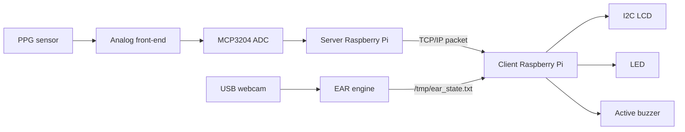
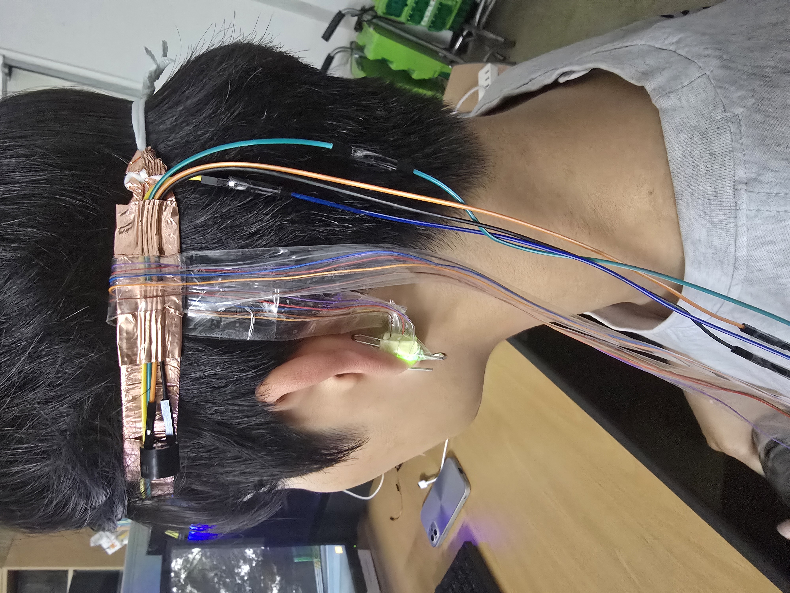
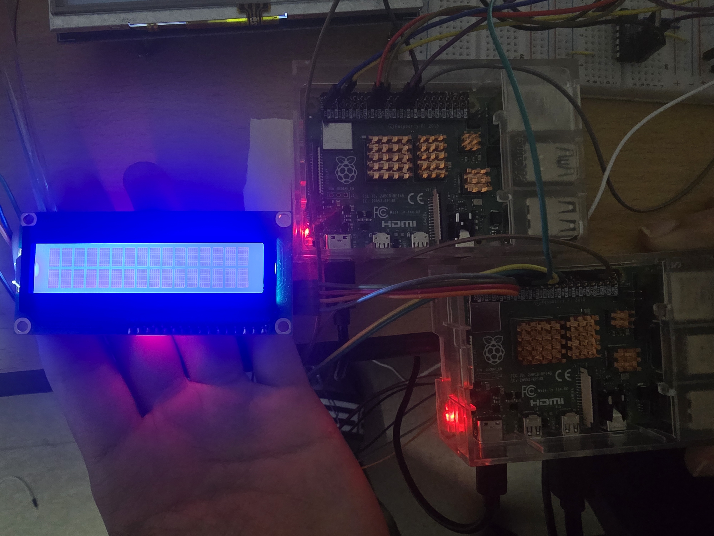
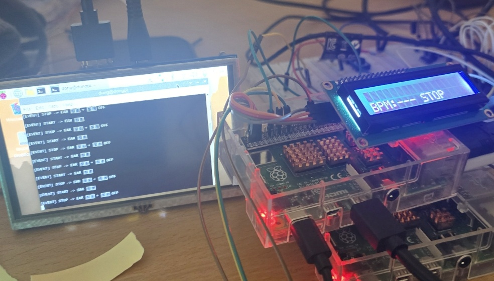

# 실시간 졸음 모니터링 및 방지 디바이스 설계

> Raspberry Pi 4 기반 **PPG 생체신호 + EAR 영상지표 + TCP/IP 분산 처리 + GPIO/I2C 알람 제어** 포트폴리오 문서화 저장소입니다.


## 1. 프로젝트 핵심 요약

본 프로젝트는 운전 또는 장시간 집중 작업 상황에서 발생 가능한 졸음 상태를 실시간으로 탐지하고, 졸음 확정 시 LED와 Active Buzzer를 통해 즉각적인 각성 경고를 제공하는 웨어러블 임베디드 시스템입니다.

| 항목 | 구현 내용 |
|---|---|
| Target board | Raspberry Pi 4 × 2대 |
| 구조 | Sensing Server(Node A) + Analysis/Alarm Client(Node B) 분산 구조 |
| 생체신호 | PPG analog circuit → MCP3204 ADC → HPF/LPF → peak detection → BPM |
| 영상지표 | USB webcam → face/eye landmark → EAR → closed-eye duration |
| 주 판정 지표 | EAR, threshold 0.22, 약 2초 이상 지속 시 DROWSY |
| 보조 지표 | BPM은 LCD 모니터링 값으로 표시 |
| 통신 | TCP/IP socket, port 5000, `SN-RPI-001,BPM,status` packet |
| 출력 | LCD1602 I2C, LED, Active Buzzer |
| 실시간 설계 | 200 Hz PPG sampling, GPIO ISR, non-blocking alarm timer, file IPC |

## 2. 왜 2개의 Raspberry Pi로 나누었는가

카메라 기반 EAR 분석은 OpenCV 영상 처리로 연산 부하가 크고, PPG는 5 ms 주기의 안정적인 샘플링이 필요합니다. 따라서 본 설계는 두 기능을 물리적으로 분리하여 **ADC 데이터 누락과 알람 지연을 줄이는 구조**를 사용했습니다.



## 3. 핵심 알고리즘 공식

### 3.1 ADC 변환

```math
V_{in}[n] = \frac{ADC_{raw}[n]}{4095} V_{REF}
```

MCP3204는 12-bit ADC이므로 raw range는 0~4095입니다.

### 3.2 1차 HPF

```math
y_{HPF}[n] = \alpha \left(y_{HPF}[n-1] + x[n] - x[n-1]\right), \quad \alpha=0.995
```

DC offset, baseline wander, 호흡성 저주파 흔들림을 줄입니다.

### 3.3 1차 LPF

```math
y_{LPF}[n] = y_{LPF}[n-1] + \beta \left(x[n] - y_{LPF}[n-1]\right), \quad \beta=0.075
```

전원 잡음, 동잡음, 고주파 성분을 완화합니다.

### 3.4 BPM 계산

```math
IBI_{ms}=t_{peak,k}-t_{peak,k-1}
```

```math
BPM = \frac{60000}{IBI_{ms}}
```

### 3.5 EAR 계산

```math
EAR = \frac{\lVert p_2-p_6\rVert + \lVert p_3-p_5\rVert}{2\lVert p_1-p_4\rVert}
```

눈을 감으면 세로 거리 항이 감소하므로 EAR 값이 낮아집니다. 구현 기준은 `EAR < 0.22` 상태가 2000 ms 이상 지속되는 경우입니다.

## 4. 코드 파일

| 파일 | 역할 | 상세 문서 |
|---|---|---|
| `src/ppg.c` | MCP3204 PPG sampling, HPF/LPF, peak detection, BPM calculation | [ppg.c deep dive](docs/code/ppg_c.md) |
| `src/server.c` | TCP server, START/STOP ISR, BPM/status packet transmission | [server.c deep dive](docs/code/server_c.md) |
| `src/client.c` | TCP client, LCD/HMI, EAR IPC, drowsiness decision, LED/buzzer control | [client.c deep dive](docs/code/client_c.md) |
| `scripts/run_ear.sh` | EAR engine 실행, stdout filtering, `/tmp/ear_state.txt` IPC update | [run_ear.sh deep dive](docs/code/run_ear_sh.md) |
| `src/ear.cpp` | OpenCV EAR engine reconstruction and reference implementation | [ear.cpp deep dive](docs/code/ear_cpp.md) |

## 5. 문서 구성

| 문서 | 내용 |
|---|---|
| [System Overview](docs/01_system_overview.md) | 프로젝트 목적, 전체 기능, 시연 흐름 |
| [Hardware GPIO](docs/02_hardware_gpio.md) | GPIO 입력/출력, SPI, I2C, USB, TCP 구분 |
| [PPG Signal Processing](docs/03_ppg_signal_processing.md) | ADC, 필터, 피크 검출, BPM 공식 |
| [EAR Algorithm](docs/04_ear_algorithm.md) | EAR 공식, threshold, closed-duration 판정 |
| [TCP/IP Protocol](docs/05_tcp_ip_protocol.md) | socket 흐름, packet 구조, server/client 관계 |
| [Raspberry Pi 4 Setup](docs/06_raspberry_pi4_setup.md) | SPI/I2C 활성화, build, run |
| [Operation Sequence](docs/07_operation_sequence.md) | START/STOP 시연 절차 |
| [Results & Limitations](docs/08_results_and_limitations.md) | 결과, 한계, HRV 확장 방향 |
| [Infographics](docs/09_infographics.md) | 구조도, 파이프라인, 알고리즘 그림 모음 |
| [Formula Reference](docs/10_formula_reference.md) | 코드와 연결된 모든 공식 정리 |
| [Code Index](docs/code/README.md) | 코드별 상세 해설 index |

## 6. 실행

### 6.1 Build

```bash
make
```

### 6.2 Server Node

```bash
sudo ./build/server
# or standalone PPG diagnostic
sudo ./build/ppg
```

### 6.3 Client Node

`src/config.h` 또는 `src/client.c`의 서버 IP를 실제 Server Raspberry Pi IP로 수정한 뒤 실행합니다.

```bash
sudo ./build/client
```

### 6.4 EAR Engine

```bash
bash scripts/run_ear.sh
```

## 7. 실제 프로젝트 사진

| Wearable | Circuit/LCD | Code/Demo |
|---|---|---|
|  |  |  |

전체 사진 contact sheet는 [docs/assets/photos/contact_sheet.jpg](docs/assets/photos/contact_sheet.jpg)를 확인하십시오.

## 8. 보고서 기반 반영 사항

- 보고서의 GPIO 제한사항, 입력 3종/출력 3종 구성 반영
- PPG analog circuit, MCP3204, HPF/LPF, peak detection, IBI/BPM 공식 반영
- EAR 공식, threshold 0.22, 약 2초 지속 조건 반영
- TCP/IP socket 흐름 및 port 5000 구조 반영
- HW/SW architecture와 `/tmp/ear_state.txt` IPC 구조 반영
- `ppg.c`, `server.c`, `client.c`, `run_ear.sh` 코드별 세부 문서화 반영

## 9. 주의

업로드된 `송신부 코드.txt`, `수신부코드.txt`는 본 졸음 모니터링 C 코드가 아니라 MPU6050 기반 AirMouse Python 코드였습니다. 따라서 `legacy/`에 별도 보존했고, 본 프로젝트 핵심 C 코드와 문서는 PDF/PPT의 `ppg.c`, `server.c`, `client.c`, `run_ear.sh` 구조를 기준으로 작성했습니다.
