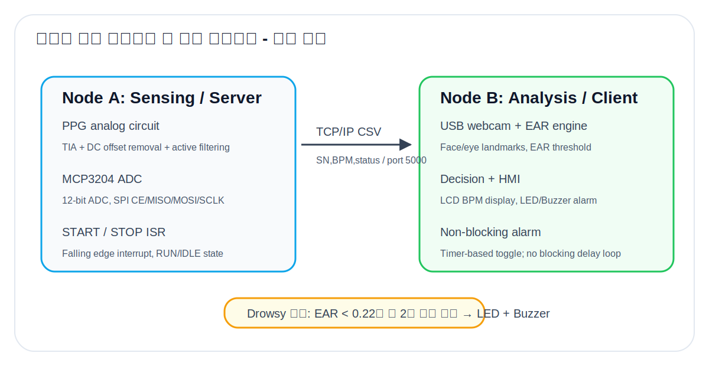
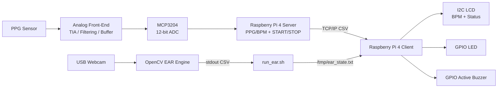

# 01. System Overview

## 1. 설계 목적

본 시스템은 사용자의 졸음 상태를 **생체신호(PPG/BPM)**와 **영상 지표(EAR)**로 동시에 관찰하고, 졸음으로 판단될 경우 **LED와 부저**로 즉시 각성 피드백을 주는 Raspberry Pi 4 기반 임베디드 시스템이다.

프로젝트의 핵심 판단 전략은 다음과 같다.

- **BPM**: PPG 센서를 통해 심박수를 계산하되, 개인차와 졸음 시 변화 폭 문제 때문에 최종 경고 트리거보다는 모니터링 보조 지표로 사용한다.
- **EAR**: 눈 개폐 상태를 직접 반영하므로 졸음 판정의 주지표로 사용한다.
- **알람**: EAR이 임계치 아래로 일정 시간 유지되면 LED/Buzzer를 토글한다.

## 2. 전체 데이터 흐름

## 3. 왜 2대의 Raspberry Pi로 분산했는가

영상 처리(OpenCV 기반 EAR 분석)는 CPU 부하가 크고 프레임 처리 지연이 발생할 수 있다. 반면 PPG는 200 Hz 수준의 고정 샘플링이 중요하다. 따라서 단일 프로세스 구조로 묶으면 카메라 처리 때문에 ADC 샘플링이 흔들릴 수 있다.

| 항목 | 단일 노드 구조 | 본 프로젝트 분산 구조 |
|---|---|---|
| PPG 샘플링 | 영상 처리 부하와 충돌 가능 | Server가 200 Hz 샘플링 전담 |
| EAR 처리 | 센서 루프와 경쟁 | Client가 OpenCV 분석 전담 |
| START/STOP | polling 사용 시 CPU 낭비 | ISR 기반 즉시 상태 전환 |
| 알람 | delay 기반이면 수신 중단 가능 | now_ms 타이머 기반 비차단 토글 |
| 확장성 | 센서 추가 시 전체 구조 수정 | 모듈별 교체/확장 가능 |

## 4. 구현 파일 매핑

| 기능 | 파일 |
|---|---|
| PPG 단독 측정/진단 | `src/ppg.c` |
| Server node TCP 송신 | `src/server.c` |
| Client node 통합 제어 | `src/client.c` |
| EAR engine 실행/로그 필터링 | `scripts/run_ear.sh` |
| OpenCV EAR engine | `src/ear.cpp` |
| 핀/네트워크 설정 | `src/config.h` |
