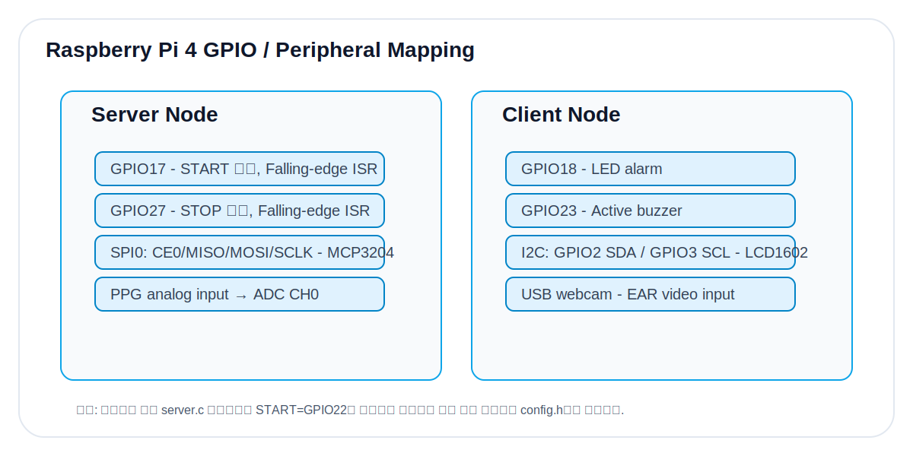

# 02. Hardware & GPIO Mapping

## 1. 하드웨어 구성

| 구분 | 장치 | 인터페이스 | 역할 |
|---|---|---|---|
| 생체센서 | PPG analog circuit | Analog → MCP3204 | 혈류량 변화 기반 PPG 파형 생성 |
| ADC | MCP3204 | SPI | 12-bit digital sample 변환 |
| 입력 | START button | GPIO interrupt | 측정 시작 이벤트 |
| 입력 | STOP button | GPIO interrupt | 측정 중지 이벤트 |
| 영상 | USB webcam | USB/V4L2 | 얼굴/눈 영상 입력 |
| 표시 | LCD1602 I2C | I2C | BPM 및 START/STOP 표시 |
| 경고 | LED | GPIO output | 시각 경고 |
| 경고 | Active buzzer | GPIO output | 청각 경고 |

## 2. GPIO 입력 조건 충족

프로젝트 보고서 기준으로 제한사항 충족은 다음처럼 정리된다.

| Pin 입력 | 장치 | 장치 개수 | 조건 |
|---|---|---:|---|
| GPIO Input | PPG sensor(MCP3204 연결), START button, STOP button | 3 | 충족 |
| GPIO Output | I2C LCD, LED, Active Buzzer | 3 | 충족 |
| HDMI/USB | HDMI display, keyboard, mouse, webcam | 4 | 별도, GPIO 집계 제외 |

## 3. Raspberry Pi 4 기준 핀 매핑

`wiringPiSetupGpio()`를 사용하므로 코드의 숫자는 **BCM GPIO 번호**이다.

| 기능 | BCM GPIO | 코드 매크로 | 설명 |
|---|---:|---|---|
| START button | 17 | `GPIO_START` | Pull-up 입력, falling edge ISR |
| STOP button | 27 | `GPIO_STOP` | Pull-up 입력, falling edge ISR |
| MCP3204 CE0 | 8 | SPI0 CE0 | `SPI_CH=0` |
| MCP3204 MISO | 9 | SPI0 MISO | ADC DOUT |
| MCP3204 MOSI | 10 | SPI0 MOSI | ADC DIN |
| MCP3204 SCLK | 11 | SPI0 SCLK | ADC CLK |
| LCD SDA | 2 | I2C SDA | LCD1602 I2C backpack |
| LCD SCL | 3 | I2C SCL | LCD1602 I2C backpack |
| LED | 18 | `LED_PIN` | 졸음 경고 출력 |
| Active buzzer | 23 | `BUZZER_PIN` | 졸음 경고 출력 |

> ⚠️ 보고서의 `server.c` 원문 일부에는 `START_BUTTON=22`로 들어간 버전이 존재한다. 실제 최종 배선이 GPIO17이면 `src/config.h` 기본값을 그대로 사용하고, GPIO22 배선이면 `GPIO_START`만 22로 변경하면 된다.

## 4. GPIO란 무엇인가

GPIO는 General Purpose Input/Output의 약자로, 소프트웨어가 핀을 입력 또는 출력으로 설정하여 외부 회로 상태를 읽거나 장치를 제어할 수 있는 범용 디지털 핀이다. 본 프로젝트에서는 단순 ON/OFF 제어뿐 아니라 SPI/I2C 같은 주변장치 통신도 GPIO의 alternate function을 통해 사용한다.

## 5. 통신 핀별 전기적 주의사항

- Raspberry Pi GPIO 입력은 3.3 V logic 기준이다. 5 V를 직접 입력하면 손상 위험이 있다.
- LED는 전류 제한 저항을 반드시 사용한다.
- Active buzzer가 GPIO 허용 전류를 넘는 경우 트랜지스터 드라이버를 추가한다.
- I2C LCD는 5 V LCD backpack 사용 시 SDA/SCL pull-up 전압을 반드시 확인한다.
- SPI 배선은 GND 공통 기준이 필요하다.
