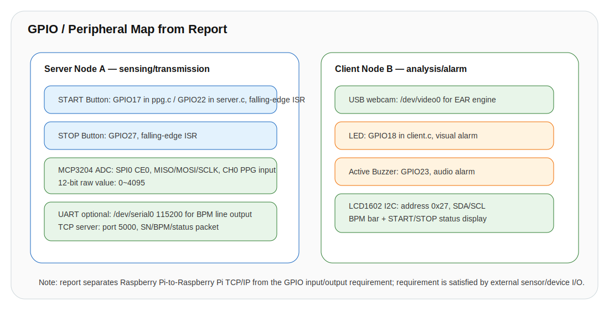
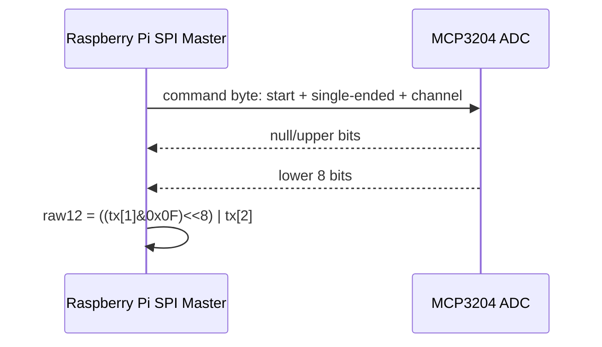

# 02. Hardware, GPIO, SPI, I2C Pin Map

## 1. 제한사항 충족 구조

보고서에서는 라즈베리파이 간 TCP/IP 통신을 제한사항의 GPIO 입출력으로 계산하지 않고, 외부 센서/장치와의 하드웨어 입출력만으로 조건을 충족했다고 명시했습니다.



## 2. 입력 장치

| 입력 | 연결 | 설명 |
|---|---|---|
| START button | GPIO interrupt input | Falling edge ISR로 측정 시작 이벤트 발생 |
| STOP button | GPIO interrupt input | Falling edge ISR로 측정 중지 이벤트 발생 |
| PPG sensor | Analog → MCP3204 → SPI | PPG analog waveform을 12-bit digital sample로 변환 |
| USB webcam | USB | EAR 분석용 영상 입력. GPIO 제한사항 집계에는 제외 |

## 3. 출력 장치

| 출력 | 연결 | 설명 |
|---|---|---|
| LED | GPIO output | 졸음 확정 시 시각 경고 |
| Active Buzzer | GPIO output | 졸음 확정 시 청각 경고 |
| LCD1602 I2C | I2C SDA/SCL | BPM 및 START/STOP 상태 표시 |

## 4. 실제 코드 기준 핀

### 4.1 `ppg.c`

| 항목 | 코드 상수 | 의미 |
|---|---|---|
| START | `GPIO_START 17` | START ISR |
| STOP | `GPIO_STOP 27` | STOP ISR |
| SPI CE | `SPI_CH 0` | MCP3204 CE0 |
| SPI speed | `SPI_SPEED 1000000` | 1 MHz |
| UART | `/dev/serial0` | 선택적 BPM UART 출력 |

### 4.2 `server.c`

| 항목 | 코드 상수 | 의미 |
|---|---|---|
| START | `START_BUTTON 22` | TCP server의 running_status=1 |
| STOP | `STOP_BUTTON 27` | TCP server의 running_status=0 |
| SPI | `SPI_CH 0` | ADC channel 0 read |
| PORT | `5000` | TCP server port |

### 4.3 `client.c`

| 항목 | 코드 상수 | 의미 |
|---|---|---|
| LED | `LED_PIN 18` | 시각 알람 |
| BUZZER | `BUZZER_PIN 23` | 청각 알람 |
| LCD | `LCD_I2C_ADDR 0x27` | LCD1602 I2C expander address |
| EAR state | `/tmp/ear_state.txt` | run_ear.sh가 갱신하는 IPC 파일 |

## 5. GPIO 인터럽트 원리

버튼은 pull-up으로 구성됩니다. 평상시 HIGH이고 버튼을 누르면 LOW로 떨어지므로 `INT_EDGE_FALLING`을 사용합니다.

```c
pinMode(GPIO_START, INPUT);
pullUpDnControl(GPIO_START, PUD_UP);
wiringPiISR(GPIO_START, INT_EDGE_FALLING, &start_isr);
```

### 디바운스 공식

\[
\Delta t = t_{current} - t_{last}
\]

\[
\Delta t < 200ms \Rightarrow ignore
\]

버튼 접점 떨림으로 인한 중복 이벤트를 막기 위해 200 ms 미만의 연속 입력은 무시합니다.

## 6. SPI 통신

MCP3204는 SPI 기반 12-bit ADC입니다. Raspberry Pi는 CE/MISO/MOSI/SCLK 핀을 통해 ADC 값을 읽습니다.



## 7. I2C LCD 동작

`client.c`는 `wiringPiI2CSetup(0x27)`로 LCD I2C expander에 연결하고, 4-bit mode로 LCD command/data를 보냅니다.

LCD 표시 구조:

```text
line 1: ################   ← BPM bar
line 2: BPM: 82 START      ← BPM + state
```
