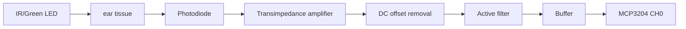

# 03. PPG Signal Processing and BPM Algorithm


## 1. PPG 신호 취득 원리

PPG(Photoplethysmography)는 LED와 광센서를 이용하여 말초 혈관의 혈액량 변화에 따른 광 흡수 변화를 측정합니다. 본 프로젝트에서는 귀에 PPG sensor clip을 부착하고, analog front-end를 거쳐 MCP3204 ADC로 digital sample을 읽습니다.

## 2. Analog Front-End

보고서의 PPG analog circuit은 포토다이오드 전류를 TIA로 전압화하고, DC offset 제거, active filtering, buffering 과정을 거쳐 ADC 입력용 PPG 신호를 생성하는 구조입니다.



## 3. ADC 변환 공식

MCP3204는 12-bit ADC이므로 digital output range는 0~4095입니다.

\[
V_{in}[n] = \frac{ADC_{raw}[n]}{4095} \cdot V_{REF}
\]

코드:

```c
static inline float adc12_to_volt(uint16_t v){
    return (float)v * (MCP_VREF / 4095.0f);
}
```

## 4. Sampling

`ppg.c`는 `SAMPLE_NS = 5000000L`을 사용합니다.

\[
T_s = 5ms = 0.005s
\]

\[
F_s = \frac{1}{T_s}=200Hz
\]

이 주기는 PPG waveform의 pulse peak를 충분히 추적하면서 Raspberry Pi에서 구현 가능한 수준입니다.

## 5. Digital Filtering

### 5.1 1차 HPF

```c
float y = h->alpha * (h->y_prev + x - h->x_prev);
```

\[
y_{HPF}[n] = \alpha(y_{HPF}[n-1] + x[n] - x[n-1])
\]

- `alpha = 0.995`
- 역할: DC offset, baseline wander, 느린 호흡성 drift 제거
- 결과: peak detection이 절대 DC level이 아니라 pulse variation에 반응하게 만듦

### 5.2 1차 LPF

```c
float y = l->y_prev + l->beta * (x - l->y_prev);
```

\[
y_{LPF}[n] = y_{LPF}[n-1] + \beta(x[n]-y_{LPF}[n-1])
\]

- `beta = 0.075`
- 역할: 고주파 noise, 순간 튐, 전원/동잡음 완화

### 5.3 Biquad optional mode

코드에는 optional `FILTER_MODE == 1`로 DF2T biquad HPF/LPF가 포함되어 있습니다.

\[
y[n] = b_0x[n]+s_1[n-1]
\]

\[
s_1[n] = b_1x[n]+s_2[n-1]-a_1y[n]
\]

\[
s_2[n] = b_2x[n]-a_2y[n]
\]

이는 Direct Form II Transposed 구조이며, 상태 변수 `s1`, `s2`를 사용합니다.

## 6. Adaptive Peak Detection


### 6.1 Envelope update

```c
env_amp = (xabs > env_amp)
    ? ENV_ATTACK*xabs + (1-ENV_ATTACK)*env_amp
    : ENV_DECAY*xabs + (1-ENV_DECAY)*env_amp;
```

\[
A[n] = 
\begin{cases}
\gamma_a |y[n]| + (1-\gamma_a)A[n-1], & |y[n]|>A[n-1] \\
\gamma_d |y[n]| + (1-\gamma_d)A[n-1], & |y[n]|\le A[n-1]
\end{cases}
\]

- attack `ENV_ATTACK = 0.40`
- decay `ENV_DECAY = 0.02`
- amplitude가 빠르게 커질 때는 빠르게 따라가고, 줄어들 때는 천천히 따라갑니다.

### 6.2 Threshold

\[
threshold[n] = K \cdot A[n]
\]

코드에서는 `TH_K = 0.10`입니다.

### 6.3 Derivative

\[
d_1[n]=y[n]-y[n-1]
\]

\[
d_2[n]=d_1[n]-d_1[n-1]
\]

- `d1`: slope
- `d2`: slope 변화량, curvature-like signal

### 6.4 State machine

| 상태 | 조건 | 의미 |
|---|---|---|
| `PK_IDLE` | `y<thr` and derivative crosses upward | valley 이후 상승 시작 대기 |
| `PK_RISING` | `y>thr` and `d2` sign change | 상승 구간에서 정점 후보 탐색 |
| `PK_SMAXED` | `d1` positive→negative and refractory passed | 최종 peak 확정 |

### 6.5 Refractory

\[
t_{now}-t_{lastpeak} > 300ms
\]

심박 peak가 너무 가까운 간격으로 중복 검출되는 것을 방지합니다. 300 ms는 약 200 BPM보다 빠른 peak를 제한합니다.

## 7. IBI and BPM

\[
IBI_{ms}=\frac{t_{peak,k}-t_{peak,k-1}}{1000}
\]

\[
BPM=\frac{60000}{IBI_{ms}}
\]

코드에서는 250~2000 ms 범위만 유효 IBI로 인정합니다.

| IBI | BPM | 의미 |
|---:|---:|---|
| 250 ms | 240 BPM | 상한 근처, 실제로는 과도한 값 |
| 750 ms | 80 BPM | 일반적인 resting range |
| 1000 ms | 60 BPM | 안정 상태 |
| 2000 ms | 30 BPM | 하한 근처 |

## 8. 이상치 처리

| 코드 | 역할 |
|---|---|
| `is_rail(v)` | `0` 또는 `4095` rail saturation 제거 |
| `is_big_jump(a,b)` | raw 차이가 800 초과면 접촉 불량/순간 spike로 간주 |
| `isfinite(y)` | NaN/Inf 후단 전파 방지 |
| `±5.0 clipping` | 필터 상태 폭주 방지 |

## 9. PPG 한계와 설계 결정

단순 BPM은 졸음 판정의 독립 trigger로 쓰기에는 개인차와 반응 지연 문제가 있습니다. 본 프로젝트는 BPM을 LCD 모니터링 보조값으로 사용하고, 최종 졸음 trigger는 EAR 기반으로 설계했습니다.
