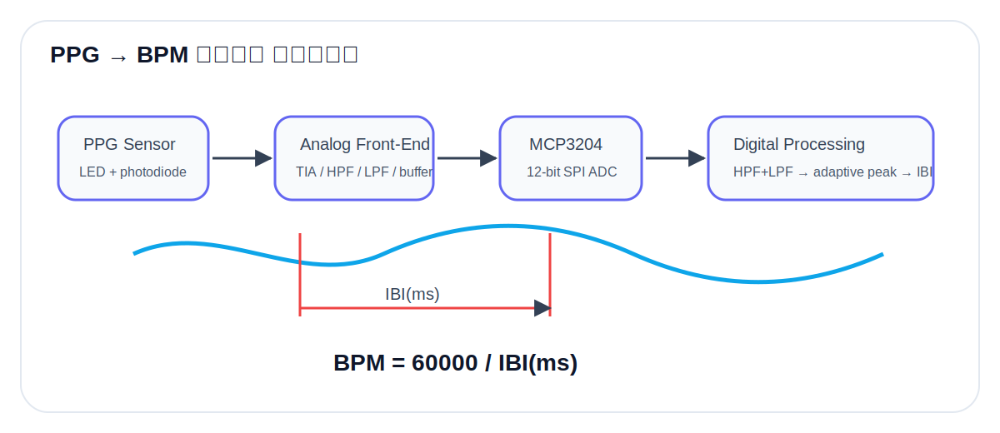
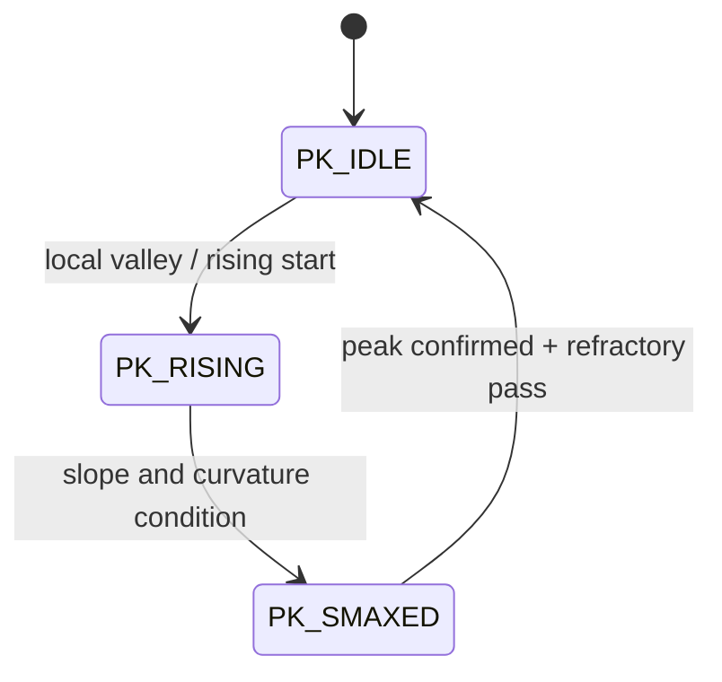

# 03. PPG Signal Processing



## 1. PPG 측정 원리

PPG(Photoplethysmography)는 LED 빛을 조직에 조사하고, 혈류량 변화에 따른 반사/투과광 변화를 포토다이오드가 검출하는 방식이다. 포토다이오드 전류는 매우 작기 때문에 TIA(Transimpedance Amplifier)로 전압 신호로 변환하고, DC offset 제거 및 필터링을 거쳐 ADC 입력에 맞는 신호로 만든다.

## 2. Analog Front-End

보고서의 회로 흐름은 다음과 같다.

```text
Photodiode current → TIA amplification → DC offset removal → Active filtering → Buffer → MCP3204 CH0
```

### 설계 의도

| 블록 | 역할 |
|---|---|
| TIA | 포토다이오드 전류를 전압으로 변환 |
| DC offset removal | 피부/착용 상태에 따른 큰 DC 성분 제거 |
| Active filter | 호흡성분, 전원/동잡음, 고주파 노이즈 완화 |
| Buffer | ADC 입력 구동 안정화 |

## 3. ADC Sampling

MCP3204는 12-bit ADC이며, 코드에서는 CH0 single-ended 입력을 사용한다.

```c
unsigned char tx[3] = {0x06, 0x00, 0x00};
wiringPiSPIDataRW(SPI_CH, tx, 3);
raw12 = ((tx[1] & 0x0F) << 8) | tx[2];
```

- ADC 범위: 0 ~ 4095
- 기준 전압: `MCP3204_VREF = 3.3 V`
- 전압 변환: `V = raw * Vref / 4095`
- 샘플링: `SAMPLE_NS = 5,000,000 ns` → 200 Hz

## 4. Digital Filtering

### 4.1 1차 HPF

```text
HPF: y[n] = α · (y[n-1] + x[n] - x[n-1])
```

- 코드 기본값: `α = 0.995`
- 목적: DC offset 및 저주파 baseline wander 제거

### 4.2 1차 LPF

```text
LPF: y[n] = y[n-1] + β · (x[n] - y[n-1])
```

- 코드 기본값: `β = 0.075`
- 목적: 고주파 노이즈 완화

### 4.3 Biquad option

`FILTER_MODE=1`로 바꾸면 DF2T 형태의 biquad HPF/LPF 계수를 사용한다. 기본값은 현장 대응성과 디버깅 편의를 위해 1차 HPF+LPF이다.

## 5. Adaptive Peak Detection

PPG 파형은 착용 압력, 피부 접촉, 조도, 움직임에 따라 amplitude가 바뀐다. 고정 threshold를 쓰면 사람/상태별 오검출이 커질 수 있으므로, 코드에서는 envelope 기반 adaptive threshold를 사용한다.

```text
env_amp = attack/decay smoothing(|y|)
thr = TH_K × env_amp
```

### Peak State Machine



| 상태 | 의미 |
|---|---|
| `PK_IDLE` | 피크 후보 전, 신호 상승 시작 대기 |
| `PK_RISING` | threshold 근처 상승 구간 |
| `PK_SMAXED` | 정점 근처에서 기울기 변화 확인 |

## 6. Refractory Period

심장 박동 1회에 여러 local peak가 생기면 BPM이 비정상적으로 커진다. 이를 막기 위해 피크 확정 후 300 ms 동안 추가 피크를 무시한다.

```c
REFRACTORY_US = 300000UL;
```

## 7. IBI and BPM

```text
IBI = t_peak[n] - t_peak[n-1]
BPM = 60000 / IBI(ms)
```

코드에서는 IBI가 250~2000 ms 범위일 때만 유효한 심박으로 인정한다. 이는 약 30~240 BPM 범위에 해당한다.

## 8. Outlier Handling

| 예외 | 처리 |
|---|---|
| ADC rail 값 `0` 또는 `4095` | 샘플 건너뜀 |
| 이전 sample 대비 jump > 800 | 샘플 건너뜀 |
| filter output NaN/Inf | 0으로 초기화 |
| filter output 과대 진폭 | ±5.0 V 범위로 clipping |

이 처리는 현장 착용 중 접촉 불량, 케이블 흔들림, 순간 포화에 의해 BPM이 튀는 현상을 완화하기 위한 안정화 로직이다.
