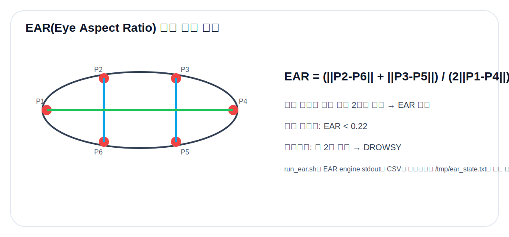

# 04. EAR Algorithm



## 1. EAR이란

EAR(Eye Aspect Ratio)은 눈의 가로 길이 대비 세로 개방 정도를 나타내는 지표이다. 얼굴 랜드마크 중 눈 주변 6개 점을 사용한다.

```text
EAR = (||P2 - P6|| + ||P3 - P5||) / (2 ||P1 - P4||)
```

눈을 뜬 상태에서는 세로 거리 2개가 유지되어 EAR이 비교적 크고, 눈을 감으면 세로 거리가 급격히 줄어 EAR이 낮아진다.

## 2. 구현 방식

본 저장소의 `src/ear.cpp`는 다음 방식으로 구현되어 있다.

1. USB webcam frame capture
2. grayscale 변환 및 histogram equalization
3. Haar cascade로 face ROI 검출
4. OpenCV Facemark LBF로 68-point facial landmark 추정
5. 좌/우 눈 landmark로 EAR 계산
6. `EAR_THR=0.22` 이하이면 eye_closed로 판단
7. closed duration이 지정 시간 이상이면 drowsy=1 출력

## 3. 출력 포맷

`ear.cpp`는 stdout으로 다음 CSV를 계속 출력한다.

```text
[ear] timestamp_ms,ear,eye_closed,closed_ms,drowsy
```

예시:

```text
[ear] 2365780,0.2778,0,0,0
[ear] 2368110,0.1842,1,2100,1
```

`run_ear.sh`는 이 stdout에서 유효한 CSV 라인만 필터링하고, 최종적으로 `/tmp/ear_state.txt`에 다음처럼 저장한다.

```text
0.1842 1
```

## 4. 왜 파일 IPC를 사용했는가

`client.c`가 OpenCV 분석 함수를 직접 호출하면 카메라 프레임 처리 때문에 TCP 수신/알람 제어가 blocking될 수 있다. 따라서 영상 엔진과 메인 제어 앱을 분리하고, 파일을 통해 최신 EAR 상태만 공유한다.

| 방식 | 장점 | 단점 |
|---|---|---|
| 직접 함수 호출 | 구조 단순 | 영상 처리 지연이 메인 루프를 막을 수 있음 |
| pipe 직접 연결 | 실시간성 좋음 | 프로세스 관리가 복잡 |
| `/tmp/ear_state.txt` | 구현 단순, non-blocking, 디버그 쉬움 | 파일 I/O 주기 관리 필요 |

## 5. 판정 로직

`client.c`는 `run_ear.sh`가 저장한 EAR 값을 읽고, 자체적으로 다시 한 번 임계값과 지속시간을 확인한다.

```c
if (last_ear > 0.0f && last_ear < EAR_THR) {
    if (ear_low_start_ms < 0) ear_low_start_ms = tms;
    if ((tms - ear_low_start_ms) >= EAR_CLOSED_MS) drowsy = 1;
} else {
    ear_low_start_ms = -1;
    drowsy = 0;
}
```

즉, `run_ear.sh`의 drowsy flag와 별개로 client에서도 안전하게 판정할 수 있다.

## 6. 한계

- 얼굴 각도가 크게 틀어지면 landmark 품질이 떨어질 수 있다.
- 안경, 머리카락, 손 가림은 눈 landmark를 방해할 수 있다.
- 조도가 낮으면 Haar cascade face detection 성능이 떨어질 수 있다.
- EAR threshold 0.22는 사용자/카메라 위치에 따라 calibration이 필요하다.
