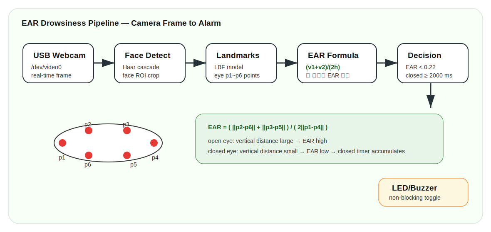
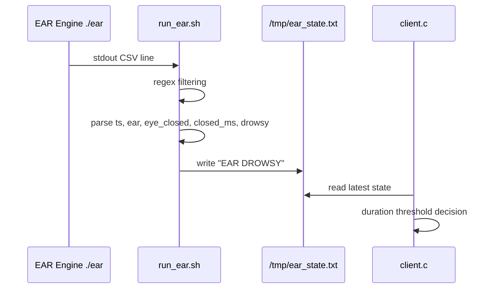

# 04. EAR Algorithm and Drowsiness Decision



## 1. EAR이란

EAR(Eye Aspect Ratio)는 눈의 가로 길이 대비 세로 열림 정도를 나타내는 비율입니다. 얼굴 landmark에서 한쪽 눈 주변의 6개 점을 사용합니다.

## 2. EAR 공식

\[
EAR = \frac{\lVert p_2-p_6\rVert + \lVert p_3-p_5\rVert}{2\lVert p_1-p_4\rVert}
\]

| 항 | 의미 |
|---|---|
| \(\lVert p_2-p_6\rVert\) | 눈의 첫 번째 세로 거리 |
| \(\lVert p_3-p_5\rVert\) | 눈의 두 번째 세로 거리 |
| \(\lVert p_1-p_4\rVert\) | 눈의 가로 거리 |
| 분모의 2 | 세로 거리 2개 평균을 가로 길이에 정규화하기 위한 계수 |

## 3. 눈 감음과 EAR 변화

| 상태 | 세로 거리 | 가로 거리 | EAR |
|---|---|---|---|
| 눈 뜸 | 큼 | 거의 일정 | 높음 |
| 눈 감음 | 작아짐 | 거의 일정 | 낮아짐 |

따라서 EAR은 절대 픽셀 크기보다 비율을 사용하므로 얼굴 거리 변화에 어느 정도 강건합니다.

## 4. Drowsiness threshold

보고서와 PPT 기준 구현 임계치는 다음과 같습니다.

\[
EAR_{thr}=0.22
\]

\[
T_{closed}=2000ms
\]

판정식:

\[
Drowsy = (EAR < 0.22) \land (t_{closed}\ge 2000ms)
\]

## 5. `client.c`의 이중 판정 구조

`run_ear.sh`는 EAR engine의 stdout에서 `ear`와 `drowsy` flag를 읽어 `/tmp/ear_state.txt`에 씁니다. 그러나 `client.c`는 해당 flag만 믿지 않고, 직접 `last_ear < EAR_THR` 상태가 2초 이상 지속되는지 다시 판단합니다.

```c
if (last_ear > 0.0f && last_ear < EAR_THR) {
    if (ear_low_start_ms < 0) ear_low_start_ms = tms;
    if ((tms - ear_low_start_ms) >= EAR_CLOSED_MS) {
        drowsy = 1;
    }
} else {
    ear_low_start_ms = -1;
    drowsy = 0;
}
```

이 구조는 영상 엔진에서 오류 flag가 들어오더라도 Client의 최종 판단 로직에서 다시 시간 조건을 검증하는 안전장치입니다.

## 6. File IPC 구조



## 7. 예외 처리

`run_ear.sh`는 얼굴 미검출 등으로 EAR이 음수일 경우 `drowsy=0`으로 강제 초기화합니다.

```bash
if awk -v ear="$ear" 'BEGIN{exit !(ear < 0)}'; then
  drowsy=0
fi
```

즉 얼굴 미검출을 졸음으로 오판하지 않도록 설계했습니다.

## 8. KNN 언급과 실제 구현 구분

보고서의 이론 파트에는 눈을 감은 시간과 속도를 분석하고 KNN으로 졸음 단계를 분류하는 구조가 설명되어 있습니다. 다만 실제 코드 수준의 핵심 구현은 `EAR threshold + closed duration`입니다. 따라서 이 저장소에서는 KNN을 구현 완료 항목으로 과장하지 않고, 이론적 확장 가능 항목으로만 분리했습니다.
