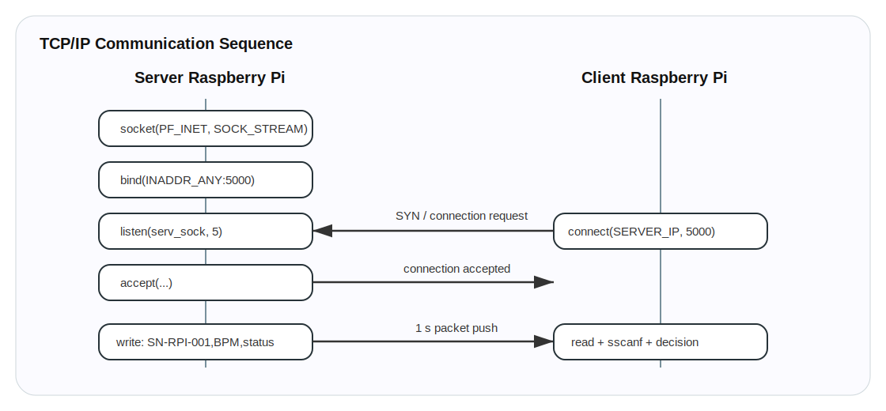
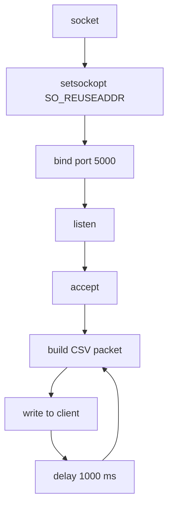

# 05. TCP/IP Protocol and Packet Flow



## 1. 통신 목적

두 Raspberry Pi 사이에는 하드웨어 배선 대신 네트워크 기반 TCP/IP 통신을 사용합니다. Server Node는 BPM과 START/STOP 상태를 Client Node로 전달합니다.

## 2. Socket server flow

`server.c`의 TCP server는 다음 순서로 동작합니다.



## 3. Packet structure

```text
SN-RPI-001,82,1
│          │  └── running_status: 1=RUN/START, 0=STOP/IDLE
│          └───── BPM value
└──────────────── serial number
```

생성 코드:

```c
sprintf(message, "%s,%d,%d", serial_num, bpm_to_send, running_status);
```

Client parsing code:

```c
sscanf(message, "%31[^,],%d,%d", sn, &bpm, &status);
```

## 4. 상태 의미

| status | 의미 | Client action |
|---:|---|---|
| 0 | STOP/IDLE | EAR process stop, alarm off, LCD STOP |
| 1 | START/RUN | EAR process start, BPM display, drowsiness decision |

## 5. START/STOP edge detection

Client는 현재 status와 직전 `last_status`를 비교하여 edge를 감지합니다.

| 조건 | 이벤트 |
|---|---|
| `status==1 && last_status==0` | START edge, `run_ear.sh` 실행 |
| `status==0 && last_status==1` | STOP edge, EAR process 종료 및 alarm off |

## 6. 전송 주기

`server.c`는 1초 간격으로 packet을 push합니다.

\[
T_{tx}=1000ms
\]

이 구조는 네트워크 부하를 낮추고 LCD BPM 표시에는 충분한 주기입니다. PPG sampling은 200 Hz로 빠르게 수행되지만, 네트워크 packet은 가공된 BPM/status만 전송합니다.

## 7. 통신 실패 처리

| 상황 | 처리 |
|---|---|
| `write(...) <= 0` | loop break, socket close |
| `read(...) <= 0` | client loop break, process stop, alarm off |
| `connect(...) == -1` | client 종료 |

## 8. 왜 TCP인가

TCP는 packet 순서 보장과 연결 지향 세션을 제공하므로, START/STOP 이벤트와 BPM 상태처럼 순서가 중요한 제어 정보 전달에 적합합니다. UDP보다 구현이 단순하고, 시연 환경에서 데이터 손실 가능성을 줄일 수 있습니다.
