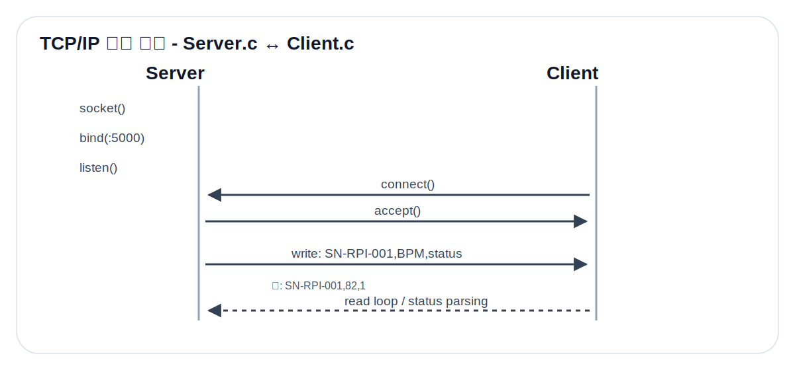
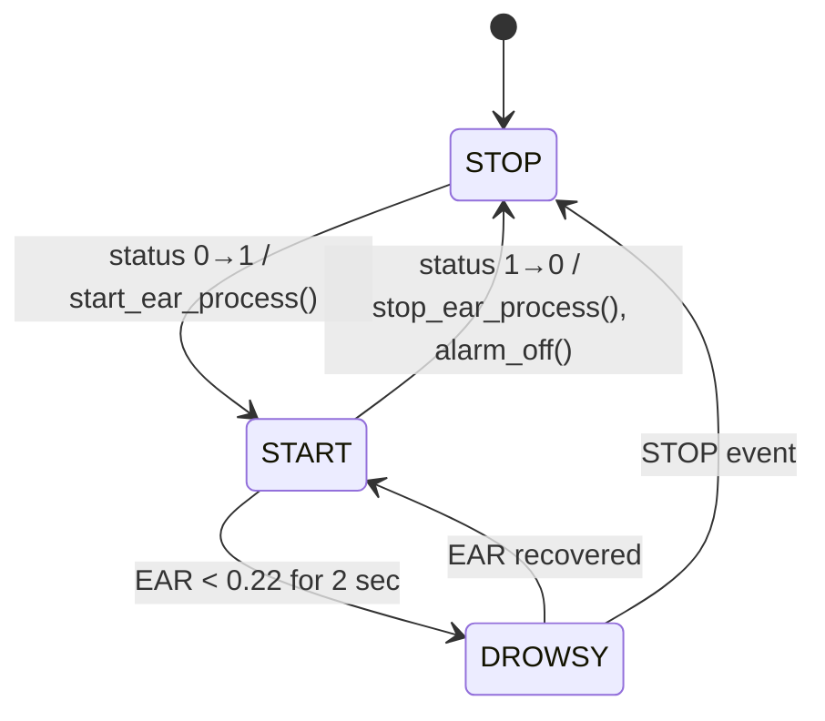

# 05. TCP/IP Protocol



## 1. 사용 이유

두 Raspberry Pi 사이에는 하드웨어 배선을 직접 연결하지 않고 TCP/IP 네트워크를 사용한다. 이렇게 하면 Server Node와 Client Node를 물리적으로 분리할 수 있고, 영상 분석 부하와 PPG 샘플링 부하를 분산할 수 있다.

## 2. Socket Flow

Server:

```text
socket() → bind(0.0.0.0:5000) → listen() → accept() → write()
```

Client:

```text
socket() → connect(SERVER_IP:5000) → read() → parse CSV
```

## 3. Packet Format

Server에서 Client로 1초 간격으로 전송한다.

```text
serial_num,bpm,status
```

예시:

```text
SN-RPI-001,82,1
SN-RPI-001,0,0
```

| Field | Type | Meaning |
|---|---|---|
| `serial_num` | string | 장치 식별자 |
| `bpm` | int | 측정된 BPM. STOP 상태면 0 |
| `status` | int | 1=START/RUN, 0=STOP/IDLE |

## 4. Client State Transition



## 5. Blocking Risk and Mitigation

- TCP `read()` 자체는 blocking이지만, Server가 1초마다 계속 packet을 보내므로 Client loop가 주기적으로 갱신된다.
- 알람은 `delay()`를 길게 쓰지 않고 `now_ms()` 비교로 토글하므로 수신 루프가 멈추지 않는다.
- EAR 엔진은 별도 프로세스로 구동하고 `/tmp/ear_state.txt`만 읽으므로 OpenCV 처리 시간이 메인 제어를 직접 막지 않는다.

## 6. 네트워크 설정 체크리스트

```bash
hostname -I
ping <server-ip>
nc -vz <server-ip> 5000
```

`src/config.h`의 `SERVER_IP`를 Client가 실제 Server Node IP로 접속하도록 수정해야 한다.
