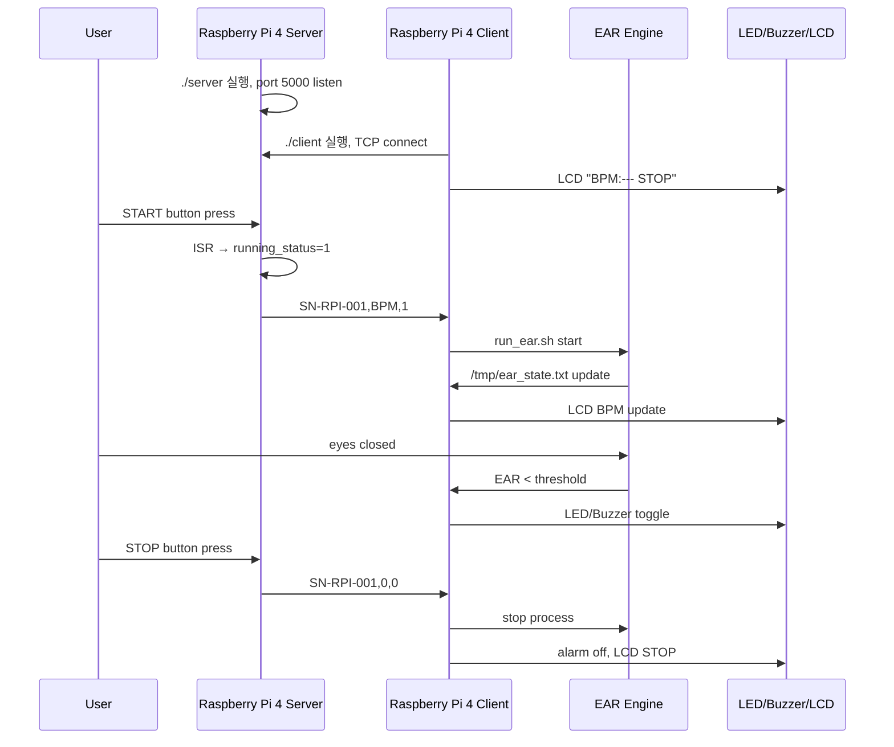
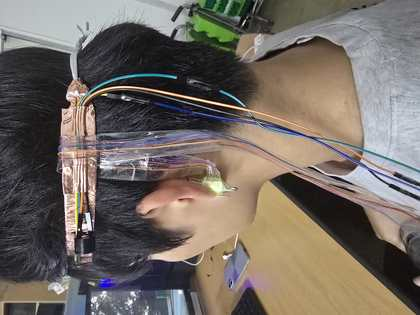
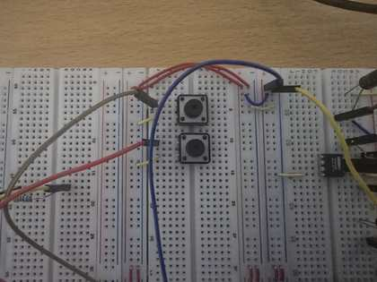
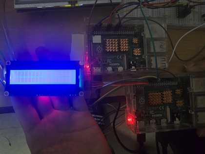

# 07. Operation Sequence

## 1. 시연 전 준비

1. 웨어러블 밴드를 머리에 착용한다.
2. PPG 센서 클립을 귀에 부착한다.
3. Server Node와 Client Node가 같은 네트워크에 연결되어 있는지 확인한다.
4. Client의 `src/config.h`에서 `SERVER_IP`를 Server Node IP로 설정한다.

## 2. 실행 순서

## 3. 상태별 동작

| 상태 | Server | Client | Output |
|---|---|---|---|
| STOP | TCP 대기/전송, BPM 0 | EAR engine 정지 | LCD `BPM:--- STOP` |
| START | PPG 샘플링/BPM 계산 | EAR engine 실행 | LCD `BPM:xxx START` |
| DROWSY | 계속 packet 전송 | EAR 지속시간 확인 | LED/Buzzer 토글 |
| STOP edge | `running_status=0` | 프로세스 종료 | Alarm off |

## 4. 실제 시연 이미지

| 착용 | 시스템 | 회로 |
|---|---|---|
|  |  |  |
