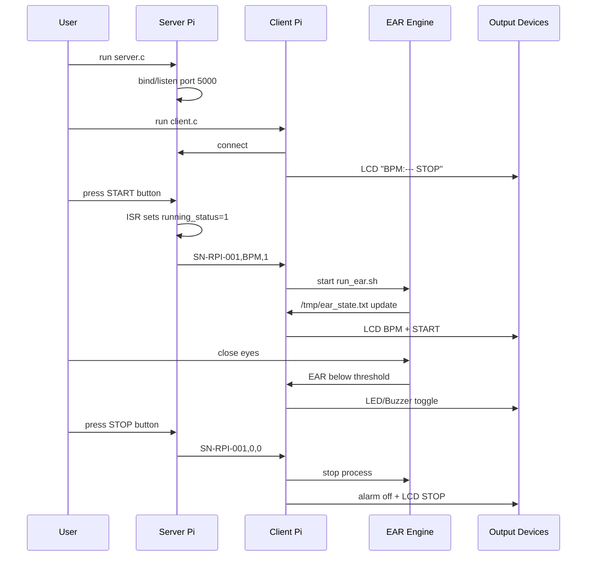

# 07. Operation Sequence

## 1. 시연 준비

1. 웨어러블 밴드를 머리에 착용합니다.
2. PPG sensor clip을 귀에 부착합니다.
3. Server Raspberry Pi와 Client Raspberry Pi가 같은 네트워크에 있는지 확인합니다.
4. Client의 `SERVER_IP`가 Server Raspberry Pi IP와 일치하는지 확인합니다.

## 2. 단계별 시퀀스



## 3. START 상태

START 버튼 입력:

```text
GPIO falling edge → ISR → running_status=1 → TCP packet status=1
```

Client 처리:

```text
status 0→1 edge → run_ear.sh background start → LCD START → EAR decision enable
```

## 4. STOP 상태

STOP 버튼 입력:

```text
GPIO falling edge → ISR → running_status=0 → TCP packet status=0
```

Client 처리:

```text
status 1→0 edge → pkill run_ear.sh / ./ear → alarm off → LCD STOP
```

## 5. 졸음 확정

조건:

\[
EAR < 0.22 \quad \text{for} \quad 2000ms
\]

출력:

- LCD는 BPM과 START 상태 유지
- LED는 `ALARM_ON_MS`/`ALARM_OFF_MS` 주기로 toggle
- Active Buzzer도 동일한 non-blocking toggle로 작동

## 6. 시연 결과 단계

보고서/PPT 기준 시연 단계는 다음 8단계입니다.

| 단계 | 내용 |
|---:|---|
| 1 | 서버 구동 |
| 2 | 클라이언트 연결 |
| 3 | Waiting 상태, LCD `BPM:--- STOP` |
| 4 | START 버튼 입력 |
| 5 | 눈 감음 인식, EAR 하락 |
| 6 | 졸음 판정, `DROWSY!` 표시 |
| 7 | LED/Buzzer 알람 트리거 |
| 8 | STOP 버튼으로 중지 제어 |
