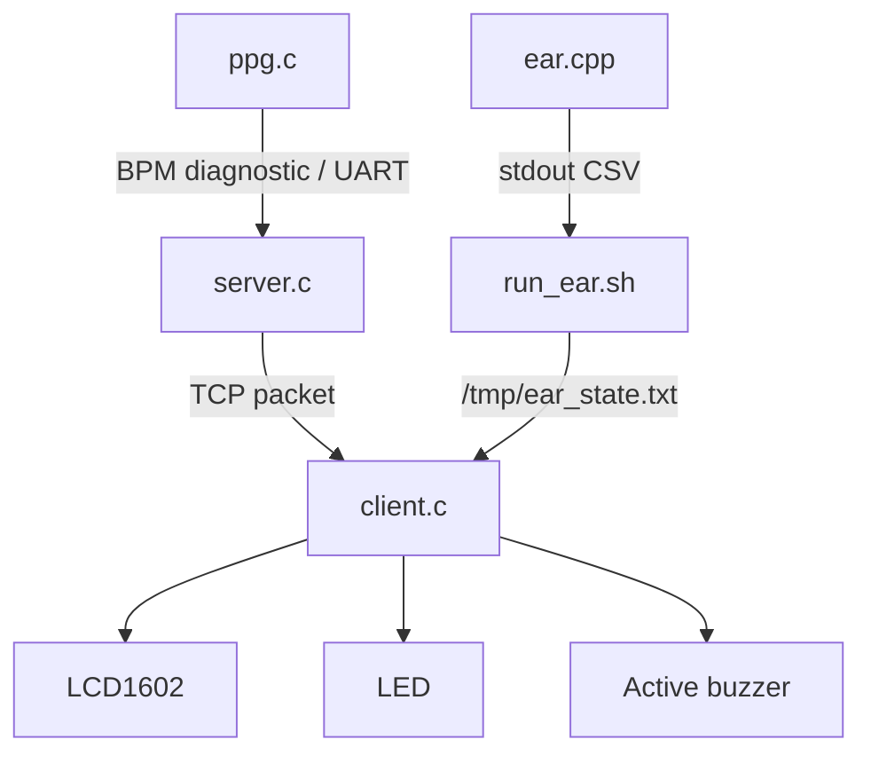

# Code Documentation Index

| 파일 | 상세 문서 | 핵심 기능 |
|---|---|---|
| `src/ppg.c` | [ppg_c.md](ppg_c.md) | PPG sampling, HPF/LPF, peak detection, BPM |
| `src/server.c` | [server_c.md](server_c.md) | TCP server, START/STOP ISR, packetizing |
| `src/client.c` | [client_c.md](client_c.md) | TCP receive, LCD, EAR IPC, alarm |
| `scripts/run_ear.sh` | [run_ear_sh.md](run_ear_sh.md) | EAR engine wrapper, regex parsing, file IPC |
| `src/ear.cpp` | [ear_cpp.md](ear_cpp.md) | OpenCV EAR reference implementation |
| `legacy/*.py` | [legacy_python.md](legacy_python.md) | Uploaded AirMouse Python scripts, not drowsiness C core |

## Code-level Architecture

