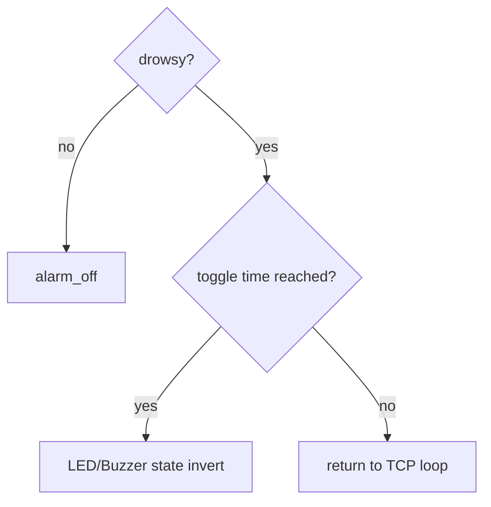

# Code Deep Dive — `src/client.c`

## 1. 역할

`client.c`는 Client Node에서 동작하며 다음 기능을 수행한다.

- Server TCP packet 수신
- I2C LCD1602 초기화 및 BPM 표시
- START/STOP edge에 따라 `run_ear.sh` 실행/중지
- `/tmp/ear_state.txt`에서 EAR 읽기
- EAR threshold + closed duration 기반 drowsy 판단
- LED/Buzzer 알람을 non-blocking 방식으로 토글

## 2. Main Loop Inputs

| 입력 | 경로 | 형태 |
|---|---|---|
| BPM/status | TCP socket | `SN,BPM,status` |
| EAR/drowsy | file IPC | `/tmp/ear_state.txt` |

## 3. LCD Driver

LCD1602 I2C backpack은 4-bit mode로 제어한다.

```c
lcd_write4(value & 0xF0, mode);
lcd_write4((value << 4) & 0xF0, mode);
```

초기화 sequence:

```text
0x30 → 0x30 → 0x30 → 0x20 → 0x28 → 0x0C → 0x06 → 0x01
```

## 4. BPM Visualization

`lcd_draw_bpm_bar()`는 BPM을 50~120 범위로 clipping하고, 16칸 LCD 첫 줄에 `#` bar로 표시한다.

```text
BPM 50  →                
BPM 85  → ########        
BPM 120 → ################
```

두 번째 줄은 상태를 표시한다.

```text
BPM:--- STOP
BPM: 82 START
```

## 5. EAR Decision Logic

```c
if (last_ear > 0.0f && last_ear < EAR_THR) {
    if (ear_low_start_ms < 0) ear_low_start_ms = tms;
    if ((tms - ear_low_start_ms) >= EAR_CLOSED_MS) drowsy = 1;
} else {
    ear_low_start_ms = -1;
    drowsy = 0;
}
```

- `EAR_THR = 0.220`
- `EAR_CLOSED_MS = 2000`

## 6. Non-Blocking Alarm

알람은 `delay(200)` 반복으로 막지 않고, 다음 toggle time을 비교한다.



이 구조 덕분에 LED/Buzzer가 울리는 중에도 TCP 수신과 LCD 갱신이 계속된다.

## 7. 실행

```bash
make client
./client
```

`src/config.h`의 `SERVER_IP`는 실제 Server Node IP로 수정해야 한다.
