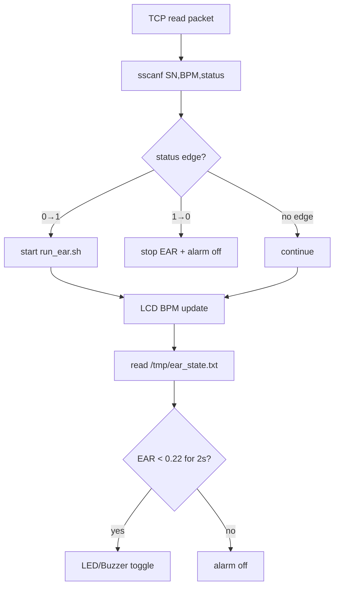

# Code Deep Dive — `src/client.c`

## 1. 역할

`client.c`는 Client Raspberry Pi에서 실행되는 메인 제어 코드입니다. TCP packet을 수신하고, LCD에 BPM/status를 표시하며, `/tmp/ear_state.txt`에서 EAR 값을 읽어 졸음 여부를 판단합니다. 졸음 확정 시 LED와 buzzer를 non-blocking 방식으로 toggle합니다.

## 2. 핵심 파라미터

| 상수 | 값 | 의미 |
|---|---:|---|
| `SERVER_IP` | `172.31.95.226` | Server Raspberry Pi IP |
| `PORT` | 5000 | TCP port |
| `LED_PIN` | 18 | LED output |
| `BUZZER_PIN` | 23 | active buzzer output |
| `LCD_I2C_ADDR` | 0x27 | LCD1602 I2C address |
| `EAR_THR` | 0.220 | eye closed threshold |
| `EAR_CLOSED_MS` | 2000 | drowsiness duration threshold |
| `ALARM_ON_MS` | 200 | alarm on duration |
| `ALARM_OFF_MS` | 200 | alarm off duration |

## 3. Overall pipeline



## 4. TCP receive and parsing

```c
int str_len = (int)read(sock, message, sizeof(message) - 1);
message[str_len] = '\0';
sscanf(message, "%31[^,],%d,%d", sn, &bpm, &status);
```

packet format:

```text
SN-RPI-001,82,1
```

## 5. START/STOP edge detection

```c
if (status == 1 && last_status == 0) {
    start_ear_process();
} else if (status == 0 && last_status == 1) {
    stop_ear_process();
}
last_status = status;
```

| transition | 동작 |
|---|---|
| 0 → 1 | EAR process 시작, LED self-test, 판정 변수 초기화 |
| 1 → 0 | EAR process 종료, alarm off, LCD STOP |

## 6. EAR process control

```c
system("pkill -f run_ear.sh >/dev/null 2>&1");
system("pkill -f \"./ear\"   >/dev/null 2>&1");
system("bash -c '/home/dong/run_ear.sh >/dev/null 2>&1 &'");
```

START 시 기존 process를 먼저 정리하고 새 process를 background로 시작합니다.

## 7. LCD driver

LCD는 I2C backpack을 사용하며, 4-bit mode로 command/data를 보냅니다.

```c
lcd_write4(value & 0xF0, mode);
lcd_write4((value << 4) & 0xF0, mode);
```

### LCD bar formula

\[
norm=\frac{BPM-50}{120-50}
\]

\[
bars=round(norm\cdot16)
\]

코드:

```c
float norm = (float)(bpm - minB) / (float)(maxB - minB);
int bars = (int)(norm * LCD_COLS + 0.5f);
```

## 8. EAR state file read

```c
static int file_read_ear_state(const char *path, float *ear_out, int *drowsy_out) {
    FILE *fp = fopen(path, "r");
    if (!fp) return 0;
    int ok = (fscanf(fp, "%f %d", &ear, &d) == 2);
    ...
}
```

format:

```text
0.2778 0
0.1800 1
```

| field | 의미 |
|---|---|
| first | EAR value |
| second | drowsy flag from shell/engine |

## 9. Drowsiness decision

```c
if (last_ear > 0.0f && last_ear < EAR_THR) {
    if (ear_low_start_ms < 0) ear_low_start_ms = tms;
    if ((tms - ear_low_start_ms) >= EAR_CLOSED_MS) {
        drowsy = 1;
    }
} else {
    ear_low_start_ms = -1;
    drowsy = 0;
}
```

\[
Drowsy=(EAR<0.22)\land(t_{closed}\ge2000ms)
\]

## 10. Non-blocking alarm

```c
if (tms >= alarm_next_toggle_ms) {
    if (alarm_state) {
        alarm_off();
        alarm_next_toggle_ms = tms + ALARM_OFF_MS;
    } else {
        alarm_on();
        alarm_next_toggle_ms = tms + ALARM_ON_MS;
    }
}
```

`delay()`로 메인 루프를 멈추지 않고 현재 시간과 다음 toggle 시간을 비교합니다. 이 방식은 alarm이 울리는 동안에도 TCP receive와 LCD update를 계속 수행할 수 있게 합니다.

## 11. Alarm output

```c
static void alarm_on(void) {
    digitalWrite(LED_PIN, LED_ON_LEVEL);
    digitalWrite(BUZZER_PIN, HIGH);
}
```

| 함수 | LED | Buzzer |
|---|---|---|
| `alarm_on()` | ON | HIGH |
| `alarm_off()` | OFF | LOW |

## 12. 포트폴리오 해석 포인트

`client.c`는 단순 output control 코드가 아니라 다음 요소를 모두 포함합니다.

- TCP stream parsing
- process lifecycle control
- file-based IPC
- LCD low-level I2C driver
- sensor fusion style decision logic
- non-blocking real-time alarm control
