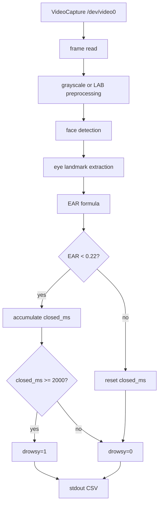

# Code Deep Dive — `src/ear.cpp`

## 1. 역할

`ear.cpp`는 보고서/PPT의 EAR engine 구조를 기준으로 재구성한 OpenCV reference implementation입니다. 실제 프로젝트 문서에서는 `run_ear.sh`가 `./ear` executable을 실행하고, 그 출력 line을 파싱하여 `/tmp/ear_state.txt`로 전달합니다.

## 2. EAR engine expected output

`run_ear.sh`는 다음 CSV format만 유효 데이터로 인정합니다.

```text
timestamp_ms,ear,eye_closed,closed_ms,drowsy
```

example:

```text
2365780,0.2778,0,0,0
2367800,0.1800,1,2020,1
```

## 3. Algorithm pipeline




## 4. EAR formula

\[
EAR=\frac{\lVert p_2-p_6\rVert+\lVert p_3-p_5\rVert}{2\lVert p_1-p_4\rVert}
\]

## 5. Distance function

\[
\lVert a-b\rVert=\sqrt{(a_x-b_x)^2+(a_y-b_y)^2}
\]

## 6. Decision

\[
Drowsy=(EAR<0.22)\land(closed\_ms\ge2000)
\]

## 7. 왜 stdout CSV인가

C client가 OpenCV C++ code와 직접 link되지 않아도 됩니다. `run_ear.sh`가 stdout을 정제하여 file IPC로 바꿔 주므로, 두 모듈의 coupling이 낮아집니다.

## 8. 포트폴리오 해석 포인트

이 구조는 임베디드 시스템에서 흔히 사용하는 **process separation + simple text protocol + watchdog-style parsing** 설계입니다. 무거운 vision engine이 실패하거나 log를 많이 출력해도 main controller는 `/tmp/ear_state.txt`의 최신 상태만 읽으면 됩니다.
