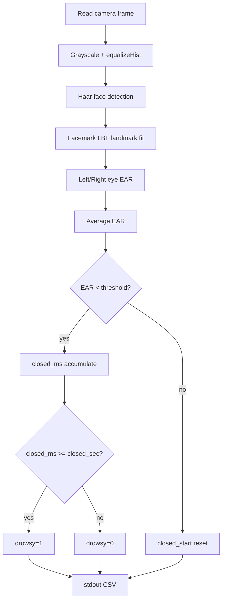

# Code Deep Dive — `src/ear.cpp`

## 1. 역할

`ear.cpp`는 `run_ear.sh`가 실행하는 OpenCV 기반 영상 분석 엔진이다. 보고서와 발표자료에는 `./ear lbfmodel.yaml ... /dev/video0 0.22 3.0 1` 형태의 실행 인터페이스와 EAR 판정 구조가 제시되어 있었고, 본 저장소에는 해당 인터페이스로 빌드 가능한 구현을 정리했다.

## 2. 입력 인자

```bash
./ear <lbfmodel.yaml> <haarcascade.xml> <video_device> <ear_thr> <closed_sec> <show>
```

| 인자 | 예시 | 의미 |
|---|---|---|
| LBF model | `lbfmodel.yaml` | OpenCV Facemark LBF landmark model |
| Cascade | `haarcascade_frontalface_default.xml` | Face detector |
| Camera | `/dev/video0` | USB webcam |
| EAR threshold | `0.22` | 눈 감김 판단 임계값 |
| Closed seconds | `3.0` | engine 내부 drowsy 지속시간 |
| Show | `1` | OpenCV 화면 표시 |

## 3. 알고리즘



## 4. EAR 계산

```cpp
double left = eye_aspect_ratio(landmarks[0], 36);
double right = eye_aspect_ratio(landmarks[0], 42);
ear = (left + right) / 2.0;
```

68-point landmark 기준:

- Left eye: 36~41
- Right eye: 42~47

## 5. stdout 설계

`run_ear.sh`가 쉽게 필터링할 수 있도록 한 줄마다 CSV로 출력한다.

```text
[ear] timestamp_ms,ear,eye_closed,closed_ms,drowsy
```

## 6. 빌드

```bash
make ear
```

OpenCV contrib의 `face` module이 필요하다.
