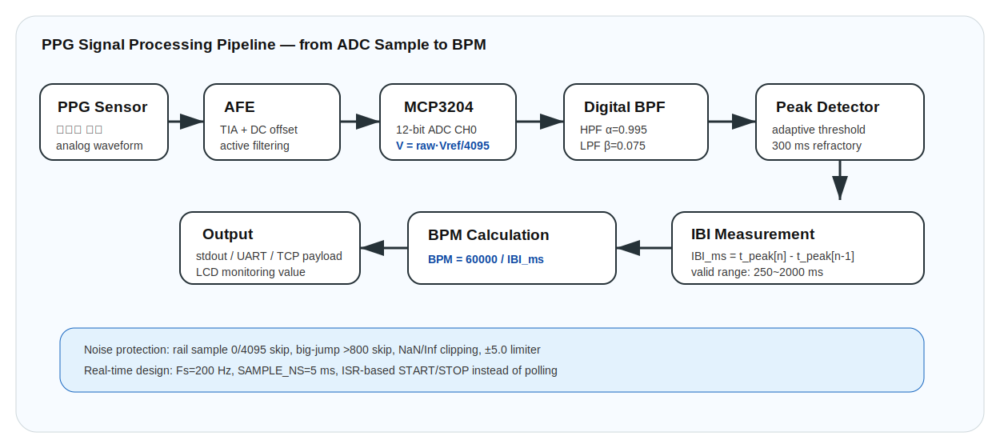
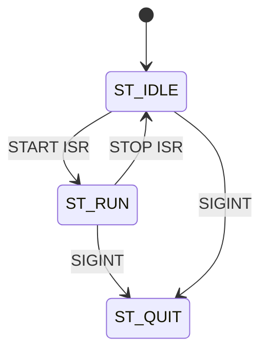
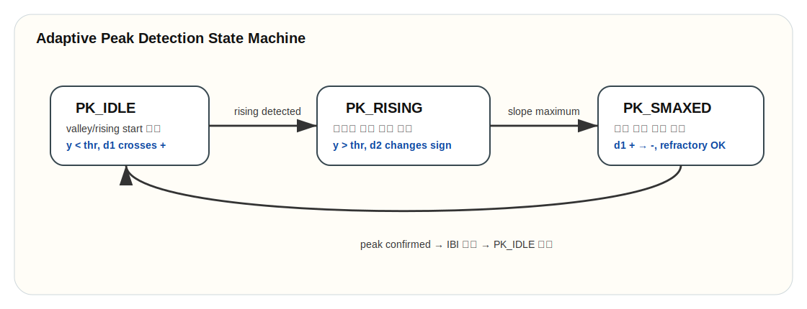
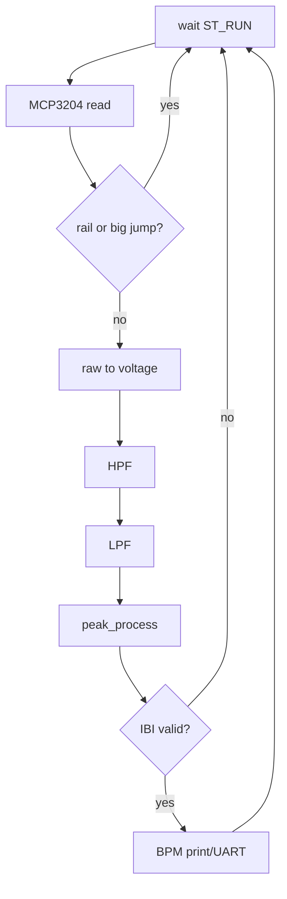

# Code Deep Dive — `src/ppg.c`



## 1. 역할

`ppg.c`는 PPG sensor의 analog signal을 MCP3204 ADC로 읽고, digital filter와 peak detector를 거쳐 BPM을 계산하는 코드입니다. 보고서 기준 기능은 다음과 같습니다.

- GPIO START/STOP button 초기화
- Falling-edge ISR 등록
- MCP3204 CH0 SPI read
- 200 Hz 고정 sampling
- HPF + LPF filtering
- adaptive threshold peak detection
- IBI 계산
- BPM 출력
- rail/outlier sample skip

## 2. 주요 상수

| 상수 | 값 | 의미 |
|---|---:|---|
| `FS_HZ` | 200.0 | sampling frequency |
| `SAMPLE_NS` | 5,000,000 ns | 5 ms sampling period |
| `SPI_CH` | 0 | SPI CE0 |
| `SPI_SPEED` | 1,000,000 | 1 MHz SPI speed |
| `MCP_VREF` | 3.3 V | ADC reference voltage |
| `GPIO_START` | 17 | START button |
| `GPIO_STOP` | 27 | STOP button |
| `g_debounce_ms` | 200 | button debounce |

## 3. System State

```c
typedef enum { ST_IDLE=0, ST_RUN=1, ST_QUIT=2 } SystemState;
```



## 4. START/STOP ISR

```c
static void start_isr(void){
    unsigned t=now_ms();
    if (t-g_last_start_ms<g_debounce_ms) return;
    g_last_start_ms=t;
    if (g_state!=ST_QUIT && g_state!=ST_RUN){
        g_state=ST_RUN;
        g_running=1;
    }
}
```

핵심은 polling 대신 hardware interrupt를 사용한다는 점입니다. 버튼 입력이 들어올 때만 ISR이 실행되므로 idle 상태 CPU 소모를 줄입니다.

## 5. MCP3204 read

```c
unsigned char tx[3]={0x06,0x00,0x00};
wiringPiSPIDataRW(SPI_CH, tx, 3);
*out12 = ((tx[1]&0x0F)<<8) | tx[2];
```

MCP3204 single-ended CH0 read sequence입니다.

```math
ADC_{raw}=((byte_1 \& 0x0F)<<8) | byte_2
```

```math
0 \le ADC_{raw} \le 4095
```

## 6. ADC voltage conversion

```c
return (float)v*(MCP_VREF/4095.0f);
```

```math
V_{in}=\frac{ADC_{raw}}{4095}V_{REF}
```

## 7. HPF

```c
float y=h->alpha*(h->y_prev + x - h->x_prev);
```

```math
y[n]=\alpha(y[n-1]+x[n]-x[n-1])
```

- `alpha = 0.995`
- DC offset 제거
- slow baseline wander 제거

## 8. LPF

```c
float y=l->y_prev + l->beta*(x - l->y_prev);
```

```
y[n]=y[n-1]+\beta(x[n]-y[n-1])
```

- `beta = 0.075`
- high-frequency noise 완화
- PPG pulse shape 보존

## 9. Biquad option

`FILTER_MODE==1`이면 DF2T biquad filter를 사용합니다.

```c
float y = q->b0*x + q->s1;
q->s1 = q->b1*x + q->s2 - q->a1*y;
q->s2 = q->b2*x - q->a2*y;
```

이는 상태 변수 `s1`, `s2`를 사용하는 direct form II transposed 구조입니다.

## 10. Adaptive envelope

```c
env_amp = (xabs>env_amp)
    ? (ENV_ATTACK*xabs + (1-ENV_ATTACK)*env_amp)
    : (ENV_DECAY*xabs + (1-ENV_DECAY)*env_amp);
float thr = TH_K*env_amp;
```

```math
thr[n]=0.10\cdot A[n]
```

신호 세기가 변해도 고정 threshold가 아니라 signal amplitude에 따라 threshold가 따라가므로 사용자/착용상태 변화에 대응합니다.

## 11. Peak detector state machine



| 상태 | 코드 조건 | 의미 |
|---|---|---|
| `PK_IDLE` | `y<thr` and derivative upward | valley 이후 상승 대기 |
| `PK_RISING` | `y>thr` and curvature changes | 정점 후보 접근 |
| `PK_SMAXED` | slope positive→negative and refractory passed | peak 확정 |

## 12. Refractory and IBI

```c
if ((last_peak_us==0)||(now-last_peak_us>REFRACTORY_US))
```

```math
REFRACTORY = 300000\mu s = 300ms
```

```c
unsigned long ibi_cur=(now-last_peak_us)/1000UL;
if (ibi_cur>=250 && ibi_cur<=2000) ibi_ms=(unsigned)ibi_cur;
```

```math
250ms \le IBI \le 2000ms
```

## 13. BPM

```c
float bpm=60000.0f/(float)ibi_ms;
```

```math
BPM=\frac{60000}{IBI_{ms}}
```

## 14. Outlier filter

| 함수 | 조건 | 이유 |
|---|---|---|
| `is_rail(v)` | `v==0 || v==4095` | ADC saturation/접촉 불량 제거 |
| `is_big_jump(a,b)` | `abs(a-b)>800` | 순간 spike 제거 |
| `isfinite(y)` | false면 0 | NaN/Inf 방지 |
| clipping | `-5.0~5.0` | filter state 폭주 방지 |

## 15. 메인 루프 파이프라인



## 16. 포트폴리오 해석 포인트

이 코드는 단순히 ADC를 읽는 수준이 아니라, real-time sampling, signal conditioning, adaptive detection, robustness handling을 포함합니다. 따라서 임베디드 시스템 포트폴리오에서는 **센서 인터페이스 + 디지털 신호처리 + 실시간 상태제어**를 모두 보여주는 핵심 코드입니다.
