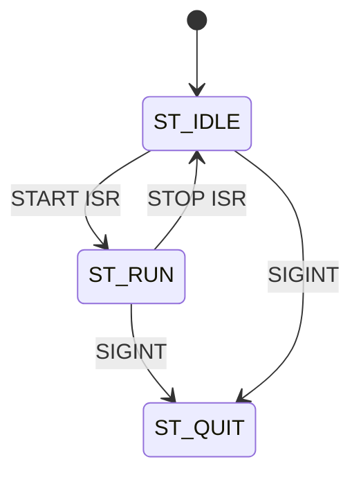
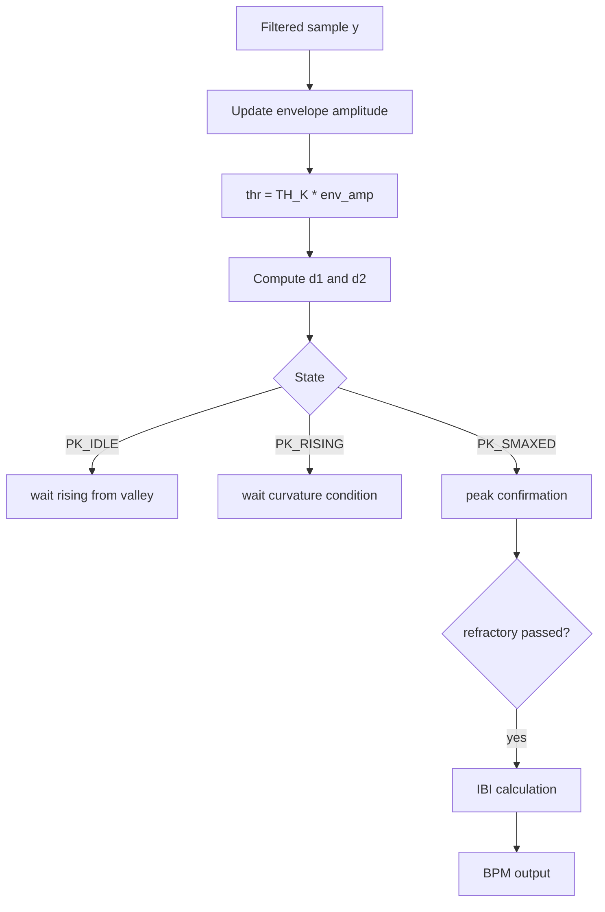

# Code Deep Dive — `src/ppg.c`

## 1. 역할

`ppg.c`는 PPG 센서 신호를 MCP3204 ADC로 읽고, 디지털 필터링과 피크 검출을 통해 BPM을 계산하는 단독 진단/측정 코드이다.

## 2. 주요 기능

| 기능 | 구현 |
|---|---|
| GPIO 초기화 | `wiringPiSetupGpio()` |
| START/STOP 입력 | `wiringPiISR(..., INT_EDGE_FALLING, ...)` |
| SPI ADC 읽기 | `wiringPiSPIDataRW(SPI_CH, tx, 3)` |
| 샘플링 주기 | `nanosleep(5 ms)` = 200 Hz |
| 필터 | HPF + LPF, optional biquad |
| 피크 검출 | adaptive threshold + state machine |
| BPM 변환 | `BPM = 60000 / IBI(ms)` |
| 이상치 제거 | rail sample, big jump sample skip |

## 3. 상태 머신



## 4. START/STOP ISR

버튼은 pull-up으로 구성되어 있으므로 누르면 GPIO가 LOW가 된다. Falling edge interrupt를 사용하면 main loop에서 버튼 상태를 계속 polling하지 않아도 된다.

```c
wiringPiISR(GPIO_START, INT_EDGE_FALLING, &start_isr);
wiringPiISR(GPIO_STOP,  INT_EDGE_FALLING, &stop_isr);
```

디바운싱은 200 ms 시간 비교로 처리한다.

## 5. MCP3204 Read

```c
tx[0] = 0x06 | ((ch & 0x04) >> 2);
tx[1] = (ch & 0x03) << 6;
tx[2] = 0x00;
wiringPiSPIDataRW(SPI_CH, tx, 3);
raw12 = ((tx[1] & 0x0F) << 8) | tx[2];
```

MCP3204는 12-bit ADC이므로 raw 값은 `0~4095`이다.

## 6. Filter Details

### HPF

```text
y[n] = α · (y[n-1] + x[n] - x[n-1])
```

- `α = 0.995`
- DC offset과 baseline wander 제거

### LPF

```text
y[n] = y[n-1] + β · (x[n] - y[n-1])
```

- `β = 0.075`
- 고주파 노이즈 완화

## 7. Peak Detection Logic



## 8. 안정화 설계

- `is_rail()`로 0/4095 포화 값 제거
- `is_big_jump()`로 순간 접촉 불량 제거
- `isfinite()`로 NaN/Inf 방지
- `±5.0` clipping으로 후단 상태 폭주 방지

## 9. 실행

```bash
make ppg
./ppg
```

START 버튼을 누르면 RUN 상태로 전환되고, STOP 버튼을 누르면 IDLE 상태로 돌아간다.
