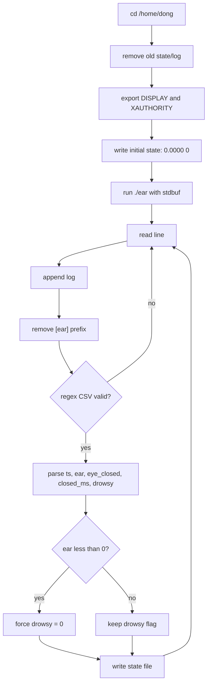

# Code Deep Dive — `scripts/run_ear.sh`

## 1. 역할

`run_ear.sh`는 OpenCV 기반 EAR engine(`./ear`)을 실행하고, stdout/stderr에서 유효한 CSV data line만 추출하여 `/tmp/ear_state.txt`에 최신 EAR/drowsy 값을 저장하는 shell wrapper입니다.

## 2. Overall pipeline



## 3. State file

```bash
STATE=/tmp/ear_state.txt
printf "%.4f %d\n" 0.0000 0 > "$STATE"
```

`client.c`는 이 파일만 읽으면 되므로 OpenCV engine의 상세 log format에 직접 의존하지 않습니다.

## 4. EAR engine command

```bash
stdbuf -oL -eL ./ear lbfmodel.yaml \
  /usr/share/opencv4/haarcascades/haarcascade_frontalface_default.xml \
  /dev/video0 0.22 3.0 1 2>&1
```

| argument | 의미 |
|---|---|
| `lbfmodel.yaml` | landmark model |
| `haarcascade_frontalface_default.xml` | face detector |
| `/dev/video0` | webcam device |
| `0.22` | EAR threshold |
| `3.0` | duration/window parameter from engine |
| `1` | show video window flag |
| `2>&1` | stderr를 stdout으로 합침 |

## 5. Why `stdbuf`?

`stdbuf -oL -eL`은 stdout/stderr를 line-buffered로 만들어 shell script가 frame/result line을 지연 없이 읽도록 합니다.

## 6. Regex filtering

```bash
if ! [[ "$line" =~ ^[0-9]+,[-+]?[0-9]*\.?[0-9]+,[01],[0-9]+,[01]$ ]]; then
  continue
fi
```

valid CSV example:

```text
2365780,0.2778,0,0,0
```

| field | 의미 |
|---|---|
| `2365780` | timestamp |
| `0.2778` | EAR |
| `0` | eye_closed flag |
| `0` | closed duration ms |
| `0` | drowsy flag |

## 7. Prefix removal

```bash
line="${line#\[ear\] }"
```

engine이 `[ear] ` prefix를 붙여도 동일하게 CSV parsing을 수행할 수 있습니다.

## 8. Face-not-detected fail-safe

```bash
if awk -v ear="$ear" 'BEGIN{exit !(ear < 0)}'; then
  drowsy=0
fi
```

EAR이 음수라는 것은 얼굴/눈 검출 실패 등 비정상 상태로 볼 수 있으므로 졸음 flag를 강제로 0으로 만듭니다. 이는 false alarm을 줄이기 위한 방어 로직입니다.

## 9. IPC output

```bash
printf "%.4f %d\n" "$ear" "$drowsy" > "$STATE"
```

최종적으로 client는 이 파일에서 두 값만 읽습니다.

```text
EAR DROWSY
```

## 10. 포트폴리오 해석 포인트

이 shell script는 단순 실행 파일이 아니라, OpenCV engine과 C main application 사이를 느슨하게 연결하는 **IPC adapter**입니다. 덕분에 영상 engine 로그 형식이 복잡해도 client code는 간단하게 유지됩니다.
