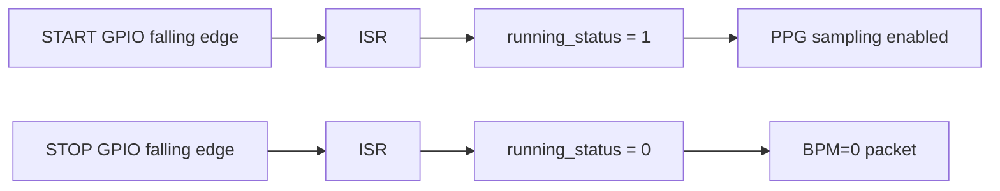

# Code Deep Dive — `src/server.c`

## 1. 역할

`server.c`는 Server Node에서 동작하며 다음 기능을 담당한다.

1. START/STOP 버튼 interrupt 처리
2. MCP3204 ADC로 PPG sample 읽기
3. 간단 HPF/LPF + adaptive peak로 BPM 계산
4. TCP server socket 생성
5. Client로 `serial,bpm,status` packet 주기 전송

## 2. Packet Format

```text
SN-RPI-001,82,1
```

| Field | 의미 |
|---|---|
| `SN-RPI-001` | device serial number |
| `82` | BPM |
| `1` | status. `1=START`, `0=STOP` |

## 3. Socket 과정

```c
socket(PF_INET, SOCK_STREAM, 0);
bind(serv_sock, ... :5000);
listen(serv_sock, 5);
accept(serv_sock, ...);
write(clnt_sock, message, strlen(message));
```

## 4. START/STOP 상태 처리



## 5. 왜 1초마다 전송하는가

PPG 샘플링은 200 Hz로 빠르지만, LCD에 표시하는 BPM과 START/STOP 상태는 1초 단위 갱신으로 충분하다. 매 sample마다 TCP로 보내면 네트워크 overhead가 커지고 Client LCD 갱신도 불필요하게 잦아진다.

## 6. 원문 코드 보존

보고서 PDF에 포함된 `server.c` 원문은 `original_from_report/server_report_original.c`에 보존했다. 원문은 시연 편의를 위해 BPM을 간단히 난수화한 부분이 있으므로, 포트폴리오용 메인 구현인 `src/server.c`는 `src/ppg.c`의 실제 PPG 필터/피크 검출 흐름을 반영하여 정리했다.

## 7. 실행

```bash
make server
./server
```

Client가 접속하면 START/STOP 상태와 BPM이 CSV packet으로 전송된다.
