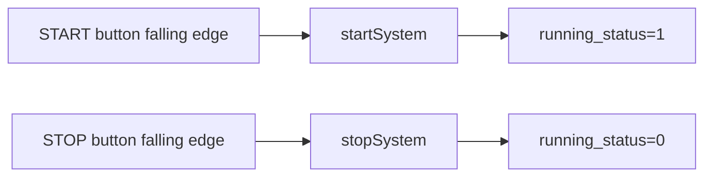
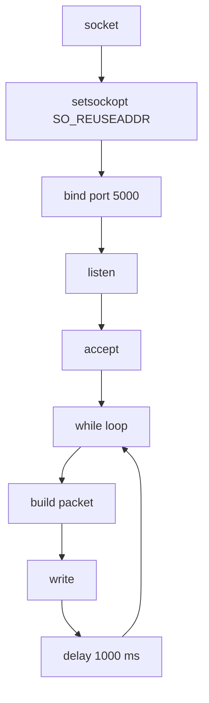

# Code Deep Dive — `src/server.c`


## 1. 역할

`server.c`는 Server Raspberry Pi에서 실행되는 TCP server 코드입니다. START/STOP button ISR로 `running_status`를 갱신하고, BPM과 status를 CSV packet으로 묶어 Client Raspberry Pi로 전송합니다.

## 2. 주요 구성

| 구성 | 코드 | 의미 |
|---|---|---|
| START button | `START_BUTTON 22` | 측정 시작 |
| STOP button | `STOP_BUTTON 27` | 측정 중지 |
| SPI | `SPI_CH 0` | MCP3204 read |
| ADC channel | `ADC_CH 0` | PPG input channel |
| TCP port | `5000` | Client 접속 port |
| serial number | `SN-RPI-001` | packet identifier |

## 3. START/STOP ISR

```c
void startSystem() { running_status = 1; printf("[EVENT] 측정 시작"); }
void stopSystem()  { running_status = 0; printf("[EVENT] 측정 중지"); }
```



## 4. ADC read

```c
buff[0] = 1;
buff[1] = (8 + channel) << 4;
buff[2] = 0;
wiringPiSPIDataRW(SPI_CH, buff, 3);
return ((buff[1] & 3) << 8) + buff[2];
```

이 구현은 MCP3008 스타일 command와 유사한 단순 read 형태입니다. 실제 MCP3204의 12-bit read와 엄밀히 맞추려면 `ppg.c`의 MCP3204 read 방식을 기준으로 통합하는 것이 더 좋습니다. 포트폴리오 문서에서는 이 부분을 개선 포인트로 명시합니다.

## 5. BPM generation

```c
int getActualBPM() {
    int rawValue = readADC(ADC_CH);
    int threshold = 750;
    if (rawValue > threshold) return 0;
    return (rand() % 20) + 76;
}
```

이 함수는 실제 peak-based BPM 계산이 아니라 시연용 BPM value generation에 가깝습니다. `rawValue > threshold`이면 센서 미착용/입력 부재로 보고 `0`을 반환하며, 그렇지 않으면 76~95 범위의 값이 생성됩니다.

따라서 본 저장소는 다음과 같이 구분합니다.

| 파일 | BPM 성격 |
|---|---|
| `ppg.c` | 실제 PPG filter/peak/IBI 기반 BPM 계산 |
| `server.c` | TCP packet 전송 시연용 BPM/status server |

## 6. TCP server flow

```c
serv_sock = socket(PF_INET, SOCK_STREAM, 0);
bind(serv_sock, ...);
listen(serv_sock, 5);
clnt_sock = accept(serv_sock, ...);
```



## 7. Packetizing

```c
sprintf(message, "%s,%d,%d", serial_num, bpm_to_send, running_status);
```

packet format:

```text
SN-RPI-001,82,1
```

| field | type | 설명 |
|---|---|---|
| `SN-RPI-001` | string | device serial |
| `82` | integer | BPM value |
| `1` | integer | running status |

## 8. 전송 주기

```c
delay(1000);
```

\[
T_{tx}=1s
\]

PPG raw sample을 모두 보내는 것이 아니라 최종 BPM/status만 전송하므로 network traffic을 줄일 수 있습니다.

## 9. 안정성 요소

| 코드 | 역할 |
|---|---|
| `SO_REUSEADDR` | program 재실행 시 port bind 오류 감소 |
| `write(...) <= 0` | client disconnect 감지 |
| `close(clnt_sock)` | 연결 자원 회수 |
| `close(serv_sock)` | server socket 회수 |

## 10. 개선 포인트

- `server.c`의 `getActualBPM()`을 `ppg.c` peak detector와 통합
- TCP packet 끝에 newline 추가하여 stream boundary parsing 개선
- `accept()` 이후 client 재접속 loop 추가
- START/STOP ISR debounce 추가
- `readADC()` command를 MCP3204 12-bit single-ended protocol로 통일
