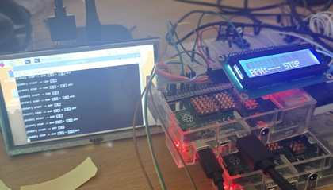

# 💤 Real-Time Sleep Monitoring & Prevention Device

> **Raspberry Pi 4 기반 실시간 졸음 모니터링 및 방지 웨어러블 디바이스**  
> PPG 기반 BPM 모니터링 + 카메라 기반 EAR 분석 + TCP/IP 분산 처리 + GPIO/I2C 알람 제어


## 1. Project Summary

본 프로젝트는 운전 또는 장시간 집중 작업 상황에서 사용자의 졸음 상태를 실시간으로 감지하고, 졸음으로 판단될 경우 **LED와 Active Buzzer**를 통해 즉시 경고하는 임베디드 시스템입니다.

핵심 구조는 다음과 같습니다.

| 구분 | 구현 내용 |
|---|---|
| 플랫폼 | Raspberry Pi 4 × 2대 분산 구조 |
| Server Node | PPG analog circuit + MCP3204 ADC + START/STOP ISR + TCP server |
| Client Node | USB webcam + EAR engine + I2C LCD + LED/Buzzer alarm |
| 생체신호 | PPG → HPF/LPF → Adaptive peak detection → IBI → BPM |
| 영상지표 | Face/Eye landmark → EAR 계산 → 0.22 threshold + closed duration |
| 통신 | TCP/IP socket, CSV packet: `SN-RPI-001,BPM,status` |
| 출력 | LCD1602 I2C, LED, Active Buzzer |

## 2. Portfolio Highlights

- **실제 Raspberry Pi 4에서 구동한 하드웨어 프로젝트**
- GPIO 입력 3종 이상, GPIO 출력 3종 이상 조건 충족
- MCP3204 12-bit ADC 기반 PPG 센싱
- 200 Hz 고정 샘플링 및 디지털 필터링
- EAR 기반 졸음 판단과 비차단 알람 제어
- TCP/IP 기반 2-node 분산 아키텍처
- 코드별 상세 문서와 구조도 제공

## 3. Repository Structure

```text
.
├── src/
│   ├── config.h          # Raspberry Pi 4 pin/network/runtime configuration
│   ├── ppg.c             # PPG sampling, filtering, peak detection, BPM calculation
│   ├── server.c          # Server node: PPG + START/STOP + TCP packet streaming
│   ├── client.c          # Client node: TCP receive + LCD + EAR IPC + alarm
│   └── ear.cpp           # OpenCV Facemark-LBF EAR engine
├── scripts/
│   ├── run_ear.sh        # EAR stdout filtering and /tmp/ear_state.txt IPC writer
│   └── setup_rpi4.sh     # Raspberry Pi 4 setup helper
├── docs/
│   ├── 01_system_overview.md
│   ├── 02_hardware_gpio.md
│   ├── 03_ppg_signal_processing.md
│   ├── 04_ear_algorithm.md
│   ├── 05_tcp_ip_protocol.md
│   ├── 06_raspberry_pi4_setup.md
│   ├── 07_operation_sequence.md
│   ├── 08_results_and_limitations.md
│   └── code/             # code-by-code deep documentation
├── original_from_report/ # cleaned original excerpt from submitted report
└── legacy/               # additionally provided Python files, preserved separately
```

## 4. Code Documentation

| Code | Role | Detailed Markdown |
|---|---|---|
| `src/ppg.c` | PPG signal acquisition, filtering, peak detection, BPM | [docs/code/ppg_c.md](docs/code/ppg_c.md) |
| `src/server.c` | TCP server and sensing node integration | [docs/code/server_c.md](docs/code/server_c.md) |
| `src/client.c` | TCP client, LCD, EAR decision, alarm control | [docs/code/client_c.md](docs/code/client_c.md) |
| `scripts/run_ear.sh` | EAR engine launcher, regex filtering, IPC file writer | [docs/code/run_ear_sh.md](docs/code/run_ear_sh.md) |
| `src/ear.cpp` | OpenCV facial landmark and EAR engine | [docs/code/ear_cpp.md](docs/code/ear_cpp.md) |

## 5. Gallery

| Wearable | Circuit | Demo |
|---|---|---|
|  |  |  |

## 6. Build

```bash
chmod +x scripts/setup_rpi4.sh scripts/run_ear.sh
./scripts/setup_rpi4.sh
make
```

Server node:

```bash
./server
```

Client node:

```bash
./client
```

Standalone PPG diagnostic:

```bash
./ppg
```

## 7. Quick Links

- [System Overview](docs/01_system_overview.md)
- [Hardware/GPIO](docs/02_hardware_gpio.md)
- [PPG Signal Processing](docs/03_ppg_signal_processing.md)
- [EAR Algorithm](docs/04_ear_algorithm.md)
- [TCP/IP Protocol](docs/05_tcp_ip_protocol.md)
- [Raspberry Pi 4 Setup](docs/06_raspberry_pi4_setup.md)
- [Operation Sequence](docs/07_operation_sequence.md)
- [Results & Limitations](docs/08_results_and_limitations.md)
- [References](docs/references.md)
