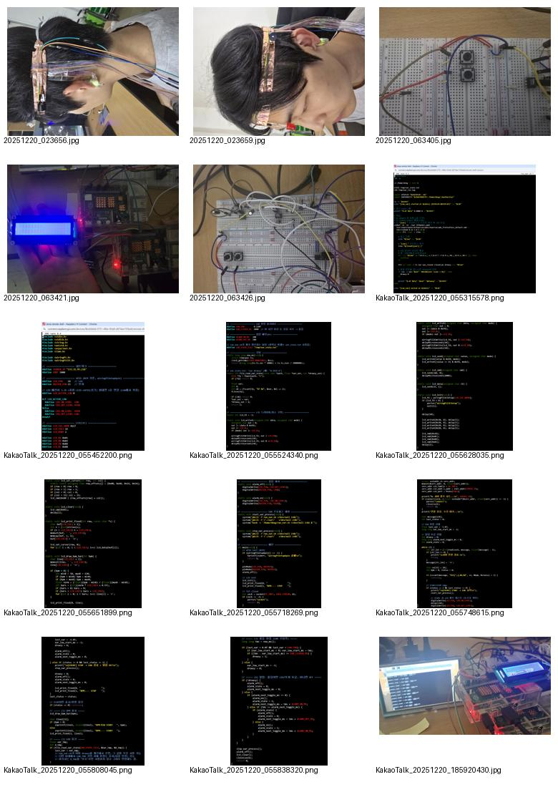

# 실시간 졸음 모니터링 및 방지 디바이스

<b>Raspberry Pi 4 기반 임베디드 포트폴리오</b> 
PPG 기반 BPM 모니터링, EAR 기반 졸음 판정, TCP/IP 분산 구조, GPIO/I2C 알람 제어를 하나의 시스템으로 통합한 프로젝트입니다.

## 핵심 포인트

| 영역 | 구현 |
|---|---|
| Hardware | Raspberry Pi 4 × 2, PPG analog circuit, MCP3204, START/STOP button, USB webcam, LCD1602, LED, buzzer |
| Signal Processing | ADC 변환, HPF, LPF, adaptive peak detection, refractory, IBI, BPM |
| Vision | Haar/LBF 기반 face/eye landmark, EAR 계산, closed duration 판정 |
| Software | C, Bash, OpenCV, wiringPi, file IPC, TCP/IP socket |
| Real-time | 200 Hz sampling, ISR, non-blocking alarm toggle |

## 알고리즘 파이프라인

### PPG → BPM

### EAR → Drowsiness

### TCP/IP 시퀀스

## 코드별 상세 문서

- [`ppg.c`](docs/code/ppg_c.md): PPG 샘플링, HPF/LPF, peak detection, BPM
- [`server.c`](docs/code/server_c.md): TCP server, ISR, packetizing
- [`client.c`](docs/code/client_c.md): LCD, EAR state file, drowsiness decision, non-blocking alarm
- [`run_ear.sh`](docs/code/run_ear_sh.md): OpenCV EAR engine wrapper, regex filter, IPC update
- [`ear.cpp`](docs/code/ear_cpp.md): EAR reference implementation

## 전체 문서

- [System Overview](docs/01_system_overview.md)
- [Hardware GPIO](docs/02_hardware_gpio.md)
- [PPG Signal Processing](docs/03_ppg_signal_processing.md)
- [EAR Algorithm](docs/04_ear_algorithm.md)
- [TCP/IP Protocol](docs/05_tcp_ip_protocol.md)
- [Raspberry Pi Setup](docs/06_raspberry_pi4_setup.md)
- [Operation Sequence](docs/07_operation_sequence.md)
- [Results and Limitations](docs/08_results_and_limitations.md)
- [Infographics](docs/09_infographics.md)
- [Formula Reference](docs/10_formula_reference.md)

## Gallery

